# EcoRoute Bharat (SIH26204): Deep Problem Statement Breakdown, Comprehensive Stakeholder Requirement Matrix, Feature Gap Analysis & Competitive USP Research

---

> **Document Type:** Master Architectural, Stakeholder & Market Analysis Document  
> **Problem Statement ID:** SIH26204 (AI-Powered Sustainable Tourism & Destination Decongestion Platform)  
> **Target Ministry / Agency:** Ministry of Tourism (Govt. of India) & Maharashtra Tourism Development Corporation (MTDC)  
> **Corridor Focus:** Western Ghats Tourism Corridor (Pune, Raigad, Satara, Ahmednagar Districts)  
> **Git Branch:** `feature/ps-stakeholder-gap-analysis`  
> **Date of Publication:** September 2026  

---

## Executive Summary

**EcoRoute Bharat** is an AI-powered, multi-stakeholder sustainable tourism intelligence and destination decongestion platform engineered to solve the systemic **80/20 tourist concentration crisis** across India's fragile cultural, pilgrimage, and ecological corridors.

Conventional travel technologies (Google Maps, Waze, MakeMyTrip, TripAdvisor) optimize strictly for individual point-to-point convenience or commercial booking volume. In doing so, they inadvertently amplify overtourism—funneling thousands of private vehicles onto narrow mountain ghat roads (e.g., NH-48 Khandala curves) and concentrating 80% of regional footfall into 5% of famous nodes, while adjacent ecological and cultural gems remain economically and touristically under-visited.

This document presents:
1. A **deep statutory analysis** of Problem Statement **SIH26204**, dissecting all 14 statutory functional requirements and their foundational mechanics.
2. A **granular stakeholder analysis**, identifying all 5 key stakeholder groups and their detailed user journeys, micro-features, and data dependencies.
3. A **rigorous gap analysis** evaluating every single capability across all stakeholders—classifying what is **DONE**, what is **PARTIALLY IMPLEMENTED**, and what is **PLANNED ON THE ROADMAP**.
4. A **deep competitive research study** benchmarking EcoRoute Bharat against 10+ Indian and international travel, navigation, pilgrimage, and smart-city platforms.
5. The **definitive Unique Selling Propositions (USPs)** that establish EcoRoute Bharat as an unprecedented paradigm shift in national tourism governance.

---

## Table of Contents

1. [Deep Problem Statement (PS) Understanding & Statutory Breakdown](#1-deep-problem-statement-ps-understanding--statutory-breakdown)
   - 1.1 [The Overtourism Crisis in Indian Tourism](#11-the-overtourism-crisis-in-indian-tourism)
   - 1.2 [Why Conventional Travel Technologies Fail](#12-why-conventional-travel-technologies-fail)
   - 1.3 [The Core Mandate of SIH26204](#13-the-core-mandate-of-sih26204)
   - 1.4 [Exhaustive Breakdown of All 14 Core Functional Requirements](#14-exhaustive-breakdown-of-all-14-core-functional-requirements)
2. [Comprehensive Stakeholder Analysis & Micro-Requirements](#2-comprehensive-stakeholder-analysis--micro-requirements)
   - 2.1 [Stakeholder 1: Tourists, Citizens & Travelers](#21-stakeholder-1-tourists-citizens--travelers)
   - 2.2 [Stakeholder 2: District Tourism & Administrative Authorities](#22-stakeholder-2-district-tourism--administrative-authorities)
   - 2.3 [Stakeholder 3: Local Tourism Businesses & Service Providers](#23-stakeholder-3-local-tourism-businesses--service-providers)
   - 2.4 [Stakeholder 4: Local Communities & Ecological Bodies](#24-stakeholder-4-local-communities--ecological-bodies)
   - 2.5 [Stakeholder 5: Platform Administrators & System Evaluators](#25-stakeholder-5-platform-administrators--system-evaluators)
3. [Granular Feature Gap Analysis: Done vs. Not Yet Done](#3-granular-feature-gap-analysis-done-vs-not-yet-done)
   - 3.1 [Audit for Stakeholder 1 (Tourists & Citizens)](#31-audit-for-stakeholder-1-tourists--citizens)
   - 3.2 [Audit for Stakeholder 2 (District & Administrative Authorities)](#32-audit-for-stakeholder-2-district--administrative-authorities)
   - 3.3 [Audit for Stakeholder 3 (Hospitality & Service Providers)](#33-audit-for-stakeholder-3-hospitality--service-providers)
   - 3.4 [Audit for Stakeholder 4 (Local Communities & Ecological Bodies)](#34-audit-for-stakeholder-4-local-communities--ecological-bodies)
   - 3.5 [Audit for Stakeholder 5 (Platform Administrators & Evaluators)](#35-audit-for-stakeholder-5-platform-administrators--evaluators)
   - 3.6 [Consolidated Platform Progress Metric](#36-consolidated-platform-progress-metric)
4. [Competitive Market Research & Landscape Analysis](#4-competitive-market-research--landscape-analysis)
   - 4.1 [Consumer Navigation Systems (Google Maps, Waze, Apple Maps)](#41-consumer-navigation-systems-google-maps-waze-apple-maps)
   - 4.2 [Commercial Online Travel Agencies (MakeMyTrip, Booking.com, Airbnb)](#42-commercial-online-travel-agencies-makemytrip-bookingcom-airbnb)
   - 4.3 [Government Tourism Portals (Incredible India, MTDC Official)](#43-government-tourism-portals-incredible-india-mtdc-official)
   - 4.4 [Religious Pilgrimage Queue Platforms (Tirupati TTD, Vaishno Devi, Char Dham)](#44-religious-pilgrimage-queue-platforms-tirupati-ttd-vaishno-devi-char-dham)
   - 4.5 [International Smart City Overtourism Platforms (Barcelona, Florence, Venice)](#45-international-smart-city-overtourism-platforms-barcelona-florence-venice)
   - 4.6 [Comprehensive Comparative Feature Matrix](#46-comprehensive-comparative-feature-matrix)
5. [Unique Selling Propositions (USPs) of EcoRoute Bharat](#5-unique-selling-propositions-usps-of-ecoroute-bharat)
6. [Strategic Roadmap & Recommended Next Steps](#6-strategic-roadmap--recommended-next-steps)

---

## 1. Deep Problem Statement (PS) Understanding & Statutory Breakdown

### 1.1 The Overtourism Crisis in Indian Tourism

India’s rapid socio-economic growth, expanding highway infrastructure, and surging domestic travel have triggered an acute spatial asymmetry in tourism:

```
┌─────────────────────────────────────────────────────────────────────────────┐
│                    THE ASYMMETRIC TOURISM PRESSURE CRISIS                   │
├──────────────────────────────────────┬──────────────────────────────────────┤
│  5% Overcrowded "Bottleneck" Hubs    │  95% Under-Visited "Eco-Twin" Nodes  │
│  (e.g., Lonavala, Mahabaleshwar)     │  (e.g., Bhandardara, Tapola, Kashid) │
├──────────────────────────────────────┼──────────────────────────────────────┤
│ • 80% of regional tourist volume     │ • < 20% of regional tourist volume   │
│ • Severe traffic gridlock on ghats   │ • Abundant capacity headroom         │
│ • Acute municipal water depletion    │ • Pristine natural & heritage assets │
│ • Solid waste management collapse    │ • Struggling local homestay economy  │
│ • Deterioration of visitor delight   │ • Untapped sustainable potential     │
│ • Landslide & monsoon safety hazards │ • Zero high-density traffic delays   │
└──────────────────────────────────────┴──────────────────────────────────────┘
```

In corridors like the **Western Ghats (UNESCO World Heritage Site)**, this imbalance creates acute crises:
- **Mobility Gridlock:** Expressways (Mumbai-Pune Expressway, NH-48) experience multi-hour blockages at ghat exits (Khandala, Khopoli), stranding thousands of families.
- **Ecological Stress:** High visitor concentration causes severe soil erosion, illegal parking in forest reserves, and municipal waste overflows into mountain rivers.
- **Economic Inequity:** Corporate hotel chains in famous hubs capture the lion's share of tourist spending, while rural homestay operators and eco-guides in nearby villages struggle for subsistence.

---

### 1.2 Why Conventional Travel Technologies Fail

Every mainstream consumer travel product today inadvertently exacerbates this crisis due to misaligned system incentives:

1. **The Navigation Paradox (Google Maps, Apple Maps, Waze):**
   - Navigation engines optimize strictly for the **individual shortest time (micro-routing)**.
   - When 10,000 drivers ask for the fastest route to a weekend hill station, the algorithm directs all 10,000 drivers onto the exact same mountain pass.
   - This manifests **Braess's Paradox / The Waze Effect**: the collective pursuit of the individual shortest path degrades highway throughput for everyone.
   - Crucially, navigation tools **cannot redirect destinations**; they can only reroute roads to the same saturated target.

2. **The OTA Popularity Trap (MakeMyTrip, Goibibo, Booking.com, TripAdvisor):**
   - Online Travel Agencies are monetized via booking commissions and sponsored hotel placements.
   - Their recommendation feeds rank destinations strictly by **historical popularity, review counts, and commission margins**.
   - This positive feedback loop funnels 85%+ of booking inquiries back into the top 5% over-visited hubs.
   - OTAs possess **zero awareness of carrying capacity, ecological vulnerability, or municipal infrastructure limits**.

3. **The Static Brochure Flaw (Government Tourism Portals):**
   - Official portals (Incredible India, MTDC) operate as static promotional directories.
   - They offer PDFs, promotional videos, and fixed festival calendars.
   - They provide **zero real-time crowd telemetry, zero predictive queue wait times, and zero operational mechanisms to manage crisis surges**.

---

### 1.3 The Core Mandate of SIH26204

The official Smart India Hackathon problem statement **SIH26204** mandates the development of an **AI-powered Sustainable Tourism Intelligence Platform** that:
> *"Predicts tourist demand and congestion at destinations and dynamically recommends alternative attractions, routes, and time slots to distribute tourist movement while preserving visitor preferences."*

The operational paradigm shifts from **Micro Individual Convenience** to **Macro Destination-Level Decongestion**:

$$\text{System Goal} = \min \sum_{i \in \text{Destinations}} \left( \frac{\text{Inflow}_i}{\text{Capacity}_i} \right)^2 \quad \text{subject to preserving traveler style affinities}$$

---

### 1.4 Exhaustive Breakdown of All 14 Core Functional Requirements

The table below provides an exhaustive breakdown of the 14 statutory requirements specified in SIH26204:

| Req # | Statutory Requirement Title | Detailed Statutory Scope | Key Inputs & Data Signals | Expected System Outputs & Algorithmic Models |
|:---:|---|---|---|---|
| **1** | **Multi-Source Tourism Signals Collection** | Ingest and synthesize historical and near-real-time tourism signals across physical, meteorological, and infrastructural dimensions. | Open-Meteo weather APIs, TomTom traffic speeds, BestTime attraction footfall, OSM Overpass POIs, FASTag toll counts, OGD India benchmarks. | Automated 60-second multithreaded ETL pipeline; normalized sensor snapshots; confidence-scored auditable telemetry. |
| **2** | **Predictive Congestion Modeling** | Forecast destination-level crowd volumes and pressure across continuous future time windows. | Historical diurnal footfall distributions, weekend/monsoon multipliers, live arrival trends, highway velocity. | 12-hour predictive diurnal curve (06:00 to 18:00); 7-day weekly rhythm profile; hourly crowd classification (Optimal / Moderate / Peak). |
| **3** | **Overcrowding Threshold Identification** | Continuously evaluate operational and environmental stress to identify destinations approaching carrying capacity limits. | Live vehicular inflow, statutory baseline safe capacity ($C_{\text{base}}$), dwell time, weather hazard index ($H_{\text{weather}}$). | **Dynamic Carrying Capacity (DCC)** index ($0.00 - 1.00$); status classification: `OPTIMAL` ($<0.70$), `MODERATE` ($0.70-0.84$), `CRITICAL` ($\ge 0.85$). |
| **4** | **Preference-Preserving Twin Recommendations** | Recommend alternative, low-congestion destinations that match the traveler’s aesthetic and cultural preferences. | 4D feature vectors $\mathbf{v} = [\text{Scenic}, \text{Budget}, \text{Adventure}, \text{Family}]$; user preference vector $\mathbf{u}$; candidate DCC scores. | 4D Vector Cosine Similarity twin matcher; candidate filtering for $\text{DCC} < 0.70$; twin card recommendations with distance and time-saved metrics. |
| **5** | **Alternative Visiting Times & Routes** | Guide travelers toward optimal low-congestion time windows and alternative highway corridors to avoid peak bottleneck hours. | Hourly Gaussian arrival distributions; highway artery delays; regional alternate bypass routes. | Time-slot selector (Dawn, Morning, Afternoon, Evening); road bypass guidance (e.g., Ghoti bypass, NH-60 artery) with ETA differentials. |
| **6** | **Expected Wait Times & Queue Estimation** | Calculate expected checkpoint delays, parking queues, and entrance waiting times for tourists. | Current inflow ($I_{\text{curr}}$), physical capacity ($C_{\text{base}}$), average visitor dwell time ($D_{\text{dwell}}$). | Queuing delay formula: $\text{Wait Mins} = \frac{I - C}{C} \times D \times 60$; real-time delay badges rendered across maps and spot pages. |
| **7** | **Tourist Movement & Demand Diffusion Analysis** | Map and analyze regional origin-to-destination mobility flows to predict how tourist demand propagates along transit corridors. | Origin hubs (Mumbai, Pune, Thane, Nashik); destination corridor nodes; transit artery throughput. | Origin-Destination (O-D) flow matrix; corridor-level vehicle counts; regional pressure distribution analytics in Authority console. |
| **8** | **Authority Demand Forecasts & Command HQ** | Provide municipal collectors and police with a unified command dashboard for multi-horizon monitoring and incident triage. | Corridor-wide telemetry feeds, destination status classifications, active advisory states, road hazard alerts. | District GIS Incident Command Center; interactive Leaflet corridor map; KPI triage bar; 2h / 6h / 12h forecast window toggles. |
| **9** | **Identification & Promotion of Under-Utilised Spots** | Identify certified under-visited destinations with tourism potential and boost their visibility through incentive schemes. | Carrying capacity headroom, cultural/scenic attractiveness ratings, under-visited metadata tags. | Algorithmic +28% feed boost in `/discover`; partner homestay promotional discount voucher codes (15%–30% off). |
| **10** | **Temporary Administrative Advisories & Controls** | Enable authorized officials to issue binding emergency gazette bulletins, travel advisories, and administrative capacity throttles. | Official hazard reports, weather warnings, severe traffic gridlock thresholds, officer credentials. | Official Gazette Advisory Dispatcher; severity tiers (`low`, `medium`, `high`, `critical`); advisory lifecycle management (revoke, extend). |
| **11** | **Multilingual Recommendations & Accessibility** | Deliver travel intelligence, safety notices, and destination guides in multiple regional Indian languages. | Multilingual localization dictionaries; localized terminology for safety and travel guidance. | Trilingual support: English, Hindi (हिन्दी), Marathi (मराठी); localized UI headers, warnings, and advisory bulletins. |
| **12** | **Sustainable Tourism & Eco-Health Indicators** | Track ecological carrying capacity, environmental health parameters, and compute averted carbon emissions. | Open-Meteo precipitation/wind telemetry, vegetation stress indices, travel distance differentials. | Ecological health gauges (water stress, wildfire, waste alert); verified Green Yatra Passes; cumulative carbon emissions avoided ($\text{kg CO}_2$). |
| **13** | **Future Multi-Day Decongested Trip Planning** | Generate intelligent multi-day vacation itineraries that avoid overcrowded bottleneck spots on peak travel days. | Origin city, travel dates, trip duration, budget tier, travel style preferences, group composition. | 4-step trip planning wizard; day-by-day morning/afternoon/evening timetables; certified eco-partner lodging suggestions. |
| **14** | **24x7 AI Tourism Helpline Assistant** | Provide an always-on conversational virtual assistant answering tourist questions with grounded real-time corridor intelligence. | Live corridor telemetry snapshot, destination DCC metrics, road safety bulletins, weather hazards. | Floating Sahyadri Guide AI assistant (1363 Helpline branded); natural language answers grounded in live corridor data. |

---

## 2. Comprehensive Stakeholder Analysis & Micro-Requirements

EcoRoute Bharat serves **five distinct stakeholder groups**, each possessing unique operational objectives, information requirements, and technical touchpoints:

```mermaid
graph TD
    EB[EcoRoute Bharat Platform]
    
    EB --> S1[Stakeholder 1: Tourists & Citizens]
    EB --> S2[Stakeholder 2: District Authorities & Police]
    EB --> S3[Stakeholder 3: MTDC Providers & Homestays]
    EB --> S4[Stakeholder 4: Local Communities & Ecology]
    EB --> S5[Stakeholder 5: Platform Admins & Evaluators]
    
    S1 --> S1_1[Real-time Congestion Radar]
    S1 --> S1_2[4D Twin Alternatives]
    S1 --> S1_3[Smart Trip Wizard]
    S1 --> S1_4[Green Yatra Pass & QR]
    
    S2 --> S2_1[District GIS Command HQ]
    S2 --> S2_2[Gazette Emergency Dispatcher]
    S2 --> S2_3[Predictive Policy Simulator]
    S2 --> S2_4[Capacity Override Sliders]
    
    S3 --> S3_1[Room Inventory Sliders]
    S3 --> S3_2[Off-Peak Voucher Creator]
    S3 --> S3_3[Local Footfall Analytics]
    
    S4 --> S4_1[Eco-Health Gauges]
    S4 --> S4_2[Community Ground Check-ins]
    S4 --> S4_3[Carbon Abatement Tracking]
    
    S5 --> S5_1[Data Tiers 1-4 Provenance]
    S5 --> S5_2[SIH Requirement Audit]
    S5 --> S5_3[BestTime Ingestion Inspector]
```



---

### 2.1 Stakeholder 1: Tourists, Citizens & Travelers

#### 2.1.1 Archetype Personas
1. **The Weekend Urban Escaper (Mumbai / Pune Family):** Traveling with children and elderly parents; seeks scenic nature without getting stuck in a 4-hour ghat traffic jam; requires clean restrooms, accessible parking, and quality dining.
2. **The Budget Trekker / Adventure Youth (College Students / Backpackers):** High adventure affinity; seeks waterfalls, fort treks, and camping; highly price-sensitive; motivated by homestay discounts and uncrowded trails.
3. **The Cultural & Heritage Pilgrim:** Visiting historic forts, temples, or UNESCO sites; requires accurate queue wait times, safe weather alerts, and parking guidance.

#### 2.1.2 Exhaustive Micro-Requirements & Feature Details
- **Zero-Guess Search & Navigation:**
  - Fast autocomplete search bar indexing Destinations (`LON` -> Lonavala), Districts (`Pune`), and States (`Maharashtra`) using fuzzy matching (`Fuse.js`).
  - Dedicated full-page categorized search results view (`/search?q=`).
  - Exhaustive regional directory (`/region/:type/:value`) sorting spots by real-time crowd status.
- **Canonical Destination Intelligence (`/spot/:spotId`):**
  - High-resolution hero imagery, travel distance, and ETA from primary origin hubs.
  - Interactive Leaflet map preview displaying the official carrying capacity polygon.
  - Real-time DCC status pill (`OPTIMAL` in emerald, `MODERATE` in amber, `CRITICAL` in rose).
  - Exact expected queue delay in minutes.
  - Interactive 12-hour predictive forecast strip (06:00 AM to 06:00 PM) with condition-colored numerical points.
  - Historical 7-day crowd rhythm graph (Mon–Sun) showing peak vs. off-peak days.
  - Practical amenity directory: OSM clean drinking water points, verified dining, parking capacity, and nearby attractions.
- **Personalized Algorithmic Discovery (`/discover`):**
  - Personalized discovery feed re-ranking destinations using the multi-objective diffusion formula:
    $$\text{Rank Score} = (0.45 \times \text{Affinity}) + (0.30 \times \text{Headroom}) + (0.25 \times \text{UnderVisitedBoost})$$
  - Filter chips: Day Trips ($\le 110\text{ km}$), Weekend Getaways ($> 110\text{ km}$), and Under-Visited Only.
- **Preference-Preserving 4D Twin Alternatives:**
  - Side-by-side alternative destination cards matching the user's travel vibe (Scenic, Budget, Adventure, Family) while ensuring $\text{DCC} < 0.70$.
  - Explicit metrics on distance delta, queue time saved (e.g., "Saves ~65 mins"), and available crowd headroom.
  - 1-click "Reroute with Green Pass" button dynamically issuing a certified discount voucher.
- **Smart 4-Step Trip Wizard & Progressive Profiling (`/plan/new`):**
  - Step 1: Destination selection (primary and optional secondary twin).
  - Step 2: Date picker with automatic weekend peak congestion warnings.
  - Step 3: Budget band selection (₹ Budget, ₹₹ Moderate, ₹₹₹ Premium).
  - Step 4: Group dynamic selection (Solo, Couple, Family, Friends).
  - Progressive profiling modal asking only 2 non-intrusive questions (origin city/state and style tags) upon trip save.
- **Confirmed Green Yatra Plan & Digital Pass (`/plan/:tripId`):**
  - Day-by-day morning, afternoon, and evening slots structured to avoid peak bottleneck hours.
  - Calculation of kilograms of $\text{CO}_2$ avoided by bypassing congested highway choke points.
  - Printable **Government Verified Green Pass Certificate** with unique alphanumeric code and verifiable QR code.
  - 15% to 30% discount voucher redeemable at partner MTDC homestays.
  - 1-click WhatsApp trip summary export and print layout formatting.
- **Public Safety & Community Voices:**
  - Real-time display of active District Police and Disaster Management advisories.
  - Crowdsourced check-in stream displaying 1★ to 5★ ratings, observed crowd conditions, and geofence verification badges.
  - Community check-in modal enabling on-ground tourists to submit real-time reports.
- **24x7 Conversational Assistance:**
  - Persistent floating AI chatbot ("Sahyadri Guide 1363") answering travel questions grounded in live corridor data.

---

### 2.2 Stakeholder 2: District Tourism & Administrative Authorities

#### 2.2.1 Archetype Personas
1. **District Collector / District Magistrate (IAS):** Responsible for public order, disaster management, and overall regional welfare; requires high-level corridor triage, impact metrics, and statutory executive controls.
2. **Superintendent of Police / Highway Traffic Command (IPS):** Enforces highway flow on mountain passes; requires real-time vehicle inflow alerts, choke point bottleneck identification, and advisory dispatch tools.
3. **District Disaster Management Authority (DDMA) Officer:** Monitors monsoon flash floods, rockfalls, and landslides; needs instant broadcast channels to divert tourist streams away from hazard zones.
4. **State Director of Tourism (Govt. of Maharashtra):** Coordinates inter-district tourism flows across Pune, Raigad, Satara, and Ahmednagar districts.

#### 2.2.2 Exhaustive Micro-Requirements & Feature Details
- **Secure Multi-Tenant RBAC & Jurisdiction Scoping:**
  - Cryptographically secured role-isolated authentication gateway (`AuthPage.tsx`).
  - Server-side jurisdiction enforcement: Pune officers (`AUTH-PUNE-01`) cannot override Raigad destinations; state directors (`AUTH-MAHA-01`) maintain statewide authority. Out-of-district actions return HTTP 403 Forbidden.
- **District GIS Incident Command Center (`/authority`):**
  - Interactive Leaflet geospatial map (`CorridorMap.tsx`) rendering all corridor destinations with dynamic capacity halo rings:
    - 🟢 Green: Safe / Optimal ($\text{DCC} < 0.70$)
    - 🟡 Amber: Moderate Warning ($0.70 \le \text{DCC} < 0.85$)
    - 🔴 Red: Critical Gridlock / Hazard ($\text{DCC} \ge 0.85$)
  - Corridor KPI summary bar: Total Active Inflow, Overall Corridor Utilization %, Count of Critical Hubs, and Diverted Tourist Volume.
  - Multi-horizon predictive triage toggles (2-hour, 6-hour, and 12-hour lookahead forecast windows).
  - High-density threshold monitoring table with 1-click drill-down directly into the canonical destination page (`/spot/:spotId`).
- **Regional Mobility Diffusion Flow Matrix (`DemandDiffusionFlow.tsx`):**
  - Real-time Origin-Destination (O-D) matrix mapping vehicular outflow from urban feeder hubs (Mumbai, Pune, Thane, Nashik) to destination nodes.
  - Tracking highway corridor throughput and early identification of converging choke point surges.
- **Canonical Destination Administrative Panel (Mounted on `/spot/:spotId`):**
  - Automatically rendered at the bottom of the destination page when an authenticated officer views the spot.
  - Jurisdiction authorization badge (Authorized District Officer vs. Read-Only Viewing).
  - **Dynamic Capacity Cap Slider:** Allows an authorized magistrate to temporarily throttle a destination's safe capacity (calling `PUT /api/destinations/:id/capacity-override`), instantly triggering twin redirections across all citizen feeds.
  - **Destination-Scoped Advisory Dispatcher:** Quick composer to issue an official bulletin specifically targeted at that destination.
- **Official Gazette Advisory Lifecycle Manager (`AdvisoryManager.tsx`):**
  - Centralized bulletin manager displaying all active, expired, and revoked emergency notices.
  - Severity classification: `low` (informational notice), `medium` (caution), `high` (severe congestion/weather), `critical` (immediate road closure/diversion).
  - Advisory actions:
    - Publish new advisory (`POST /api/advisories/broadcast`).
    - Revoke an active advisory with immediate SQLite timestamping (`POST /api/advisories/:id/revoke`).
    - Extend an advisory's expiration date (`POST /api/advisories/:id/extend`).
- **Predictive Policy Simulator Sandbox (`PolicySimulator.tsx`):**
  - Mathematical simulation sandbox allowing officers to model proposed capacity limits *before* issuing public executive orders.
  - Evaluates projected visitor deflection:
    $$\Delta \text{Deflected} = \max(0, \, I_{\text{proj}} - C_{\text{sim}})$$
  - Simulates the absorption of deflected tourists across secondary twin destinations without altering live production state.
  - Step-by-step mathematical derivation of resulting DCC stress reductions and projected queue time savings.
  - 1-click shortcut to immediately publish the simulated policy as a binding public advisory.
- **Post-Incident Impact Review & Audit (`ImpactReview.tsx`):**
  - Audit table assessing historical advisory effectiveness (comparing before vs. after DCC stress and wait times).
  - Cumulative corridor sustainability metrics: total diverted trips and cumulative $\text{CO}_2$ emissions avoided.
  - Promotion portal for under-utilized corridor destinations with abundant capacity headroom.

---

### 2.3 Stakeholder 3: Local Tourism Businesses & Service Providers

#### 2.3.1 Archetype Personas
1. **MTDC Accredited Homestay Operator (e.g., Matheran, Bhandardara, Tapola):** Rural village resident offering authentic regional hospitality; wants consistent year-round bookings rather than seasonal feast-and-famine cycles; eager to welcome tourists diverted from saturated hubs.
2. **Eco-Resort & Boutique Hotel Manager:** Operates quality lodging; needs accurate forward-looking crowd forecasts to optimize food supplies, staffing, and room tariffs.
3. **Local Trekking Guide & Adventure Operator:** Leads fort treks and kayaking tours; requires weather safety alerts and visibility to travelers seeking adventure activities.

#### 2.3.2 Exhaustive Micro-Requirements & Feature Details
- **Dedicated Provider Console (`/provider`):**
  - Dedicated business operations dashboard isolated from the tourist interface (`ProviderLayout.tsx`).
  - Overview of registered property listings, active promotional campaigns, and local corridor footfall trends.
- **Live Room Inventory & Occupancy Reporting:**
  - Interactive room occupancy percentage slider (10% to 100%) and available room count input (`LiveInventoryCard.tsx`).
  - Syncs via `PUT /api/destinations/{id}/occupancy` to update destination telemetry in real time.
  - Automated algorithmic integration: reporting high occupancy increases local parking saturation metrics and triggers off-peak voucher incentives.
- **Off-Peak & Twin Incentive Campaign Manager:**
  - Interface to create, publish, and manage promotional discount vouchers (`OffPeakIncentiveCard.tsx`).
  - Targeted discounting (e.g., 25% off room rates) during predicted off-peak visiting windows or for tourists holding Green Yatra Passes.
  - Generates redemption coupon codes (e.g., `HOMESTAY25`, `GREEN-YATRA-BHA-25`).
- **Promotional Visibility on Canonical Spot Pages:**
  - Verified business cards displayed on `/spot/:spotId` under Practical Travel Amenities, detailing verified room inventory, traveler ratings, and pricing.
  - Direct connection to Green Pass redemption workflows, allowing tourists to claim verified discounts upon arrival.

---

### 2.4 Stakeholder 4: Local Communities & Ecological Bodies

#### 2.4.1 Archetype Personas
1. **Gram Panchayat Sarpanch & Village Elders:** Residents of hill station peripheries and coastal villages; concerned about water shortages caused by hotel over-consumption, uncollected plastic waste, and traffic blocking village ambulances.
2. **Western Ghats Eco-Sensitive Zone (ESZ) Committee Member:** Forest conservationist tracking soil erosion, wildlife corridor disruption, and illegal vehicular encroachment.
3. **Maharashtra Pollution Control Board (MPCB) Inspector:** Monitors ambient air quality, noise levels, and river water contamination.

#### 2.4.2 Exhaustive Micro-Requirements & Feature Details
- **Statutory Baseline Carrying Capacity Enforcement:**
  - Carrying capacity limits explicitly grounded in authoritative statutory citations (e.g., *Maharashtra Forest Dept Carrying Capacity Study 2023*, *Matheran ESZ Notification*).
  - Automatic triggering of municipal alerts when visitor numbers breach statutory environmental thresholds.
- **Ecological Vulnerability Indicators (`EcoHealthCommunityWidget.tsx`):**
  - Real-time monitoring of ecological stress metrics:
    - **Vegetation Stress Index:** Evaluates trail degradation and ground compaction.
    - **Groundwater Depletion Index:** Reflects municipal water table strain during peak tourist weekends.
    - **Wildfire & Monsoon Hazard Index:** Integrates live rainfall and wind velocity to flag landslide and flash flood risks.
    - **Municipal Solid Waste Warning:** Flags when visitor influx outpaces municipal trash processing capacity.
- **Carbon Footprint Abatement Tracking:**
  - Algorithmic computation of greenhouse gas emissions avoided by deflecting vehicles from idling in ghat traffic jams:
    $$\text{CO}_2 \text{ Saved (kg)} = \text{Diverted Vehicles} \times \text{Avg Idle Hours Avoided} \times 2.31 \text{ kg/hr}$$
  - Transparent display on Green Pass certificates and authority dashboards.
- **Community Ground-Truth Reporting:**
  - Mechanism for local residents and verified travelers to submit geofenced check-in reports and congestion ratings (1★ to 5★), providing ground-truth calibration for sensor models.

---

### 2.5 Stakeholder 5: Platform Administrators & System Evaluators

#### 2.5.1 Archetype Personas
1. **Smart India Hackathon Evaluators / Jury Members:** Technical and domain experts auditing platform architecture, SIH26204 requirement compliance, data authenticity, and mathematical rigor.
2. **DevOps & Data Pipeline Engineers:** Responsible for backend daemon uptime, external API rate limiting, database schema integrity, and cache synchronization.

#### 2.5.2 Exhaustive Micro-Requirements & Feature Details
- **Dedicated Developer Diagnostic Lab (`/dev`):**
  - High-density system diagnostics console (`DevPortal.tsx` & `DevLayout.tsx`).
  - Real-time server uptime tracker, background worker heartbeat, and SQLite database record counters.
- **Transparent Data Provenance Breakdown (Tiers 1–4):**
  - Transparent audit widget categorizing all telemetry into 4 verifiable tiers:
    - **Tier 1 (Ground-Truth):** Toll FASTag sensors, municipal check-in counts, parking geofences.
    - **Tier 2 (Calibrated APIs):** Open-Meteo weather, TomTom traffic flow, BestTime.app attraction footfall.
    - **Tier 3 (Algorithmic Models):** Diurnal Gaussian arrival curves and historical weekly rhythms.
    - **Tier 4 (Statutory Baselines):** Authoritative forest department and government gazette carrying capacity citations.
  - **Dynamic Confidence Score Formula:** Displays an auditable percentage (50% to 98%) reflecting active sensor health and community verification.
- **External Ingestion Pipeline Transparency & Key Status:**
  - Real-time indicator of external API key statuses (`TOMTOM_API_KEY`, `BESTTIME_API_KEY`, `DATA_GOV_IN_API_KEY`, `OPEN_METEO`).
  - Explicit notification of whether live commercial endpoints or mathematical diurnal fallbacks are actively driving the numbers.
- **Interactive BestTime Footfall Telemetry Inspector:**
  - Evaluator tool to inspect live BestTime.app venue profile mappings, calibration multipliers, and 24-hour busyness curves for each corridor destination.
- **Interactive OpenAPI / Swagger Documentation:**
  - Fully interactive Swagger UI served natively at `/docs` backed by `/openapi.json`.
- **1-Click Fast Demo Credentials (`DEMO_ACCOUNTS`):**
  - Instant login buttons on `/login` pre-filling verified credentials for District Magistrate IAS Dr. Rajeshwar Patil, Raigad SP IPS Sunita Shinde, Homestay Operator Suresh Gaikwad, and Lead Engineer Ananya Deshmukh.
- **Automated Unit Test Suite:**
  - Automated Python test suite (`test_backend.py`) covering 7/7 test suites (DCC math, twin matcher, itinerary engine, RBAC auth, jurisdiction scoping, advisory lifecycle, and data pipelines).

---

### 2.6 Granular App Requirements Catalog: "We Need an App That Could..."

The following catalog provides an exhaustive, granular breakdown of every single functional need and micro-capability required in the app, explicitly mapped to each stakeholder persona:

#### 2.6.1 Requirements for Stakeholder 1: Tourists, Citizens & Travelers
1. **We need an app that could provide instant 3-tier fuzzy search (Spots, Districts, States) without guessing or returning false assumptions for the Tourist stakeholder.**
2. **We need an app that could compute and display real-time Dynamic Carrying Capacity (DCC) status (Optimal <0.70 in emerald, Moderate 0.70-0.84 in amber, Critical ≥0.85 in rose) for the Tourist stakeholder.**
3. **We need an app that could calculate and display exact checkpoint, parking, and entrance queue delays in minutes for the Tourist stakeholder.**
4. **We need an app that could plot an interactive 12-hour predictive diurnal forecast strip (06:00 AM to 06:00 PM) with condition-colored numerical points for the Tourist stakeholder.**
5. **We need an app that could render an interactive 7-day historical weekly crowd rhythm graph (Mon–Sun) showing peak vs. off-peak days for the Tourist stakeholder.**
6. **We need an app that could evaluate traveler styles across 4 dimensions (Scenic, Budget, Adventure, Family) using vector cosine similarity to recommend uncrowded twin destinations for the Tourist stakeholder.**
7. **We need an app that could present side-by-side twin alternative comparison cards detailing distance differentials, road travel times, and queue hours saved for the Tourist stakeholder.**
8. **We need an app that could dynamically rank destinations on a personalized discovery feed using a multi-objective formula balancing travel affinity (45%), crowd headroom (30%), and under-visited promotions (25%) for the Tourist stakeholder.**
9. **We need an app that could generate an eco-balanced, crowd-aware travel itinerary through a 4-step trip wizard (Destinations, Dates, Budget, Group Dynamic) for the Tourist stakeholder.**
10. **We need an app that could employ progressive profiling to capture traveler origin city and preferences only upon trip save, eliminating tedious up-front registration forms for the Tourist stakeholder.**
11. **We need an app that could issue an official, printable Government Verified Green Yatra Pass Certificate equipped with a verifiable QR code for the Tourist stakeholder.**
12. **We need an app that could calculate the exact kilograms of CO₂ avoided by bypassing congested highway bottleneck routes for the Tourist stakeholder.**
13. **We need an app that could embed a partner MTDC homestay discount voucher (15%–30% off) directly onto the Green Pass for the Tourist stakeholder.**
14. **We need an app that could provide 1-click trip summary export formatted specifically for WhatsApp sharing and print layouts for the Tourist stakeholder.**
15. **We need an app that could query OpenStreetMap Overpass APIs to display verified on-ground amenities including clean drinking water points, food stops, fuel stations, and public restrooms for the Tourist stakeholder.**
16. **We need an app that could display verified nearby hotels and homestays with real-time room counts, nightly pricing, and ratings for the Tourist stakeholder.**
17. **We need an app that could display active emergency gazette bulletins and police travel advisories prominently on destination pages with safety instructions for the Tourist stakeholder.**
18. **We need an app that could stream crowdsourced community check-in ratings (1★ to 5★), ground-truth observations, and geofence verification badges for the Tourist stakeholder.**
19. **We need an app that could allow travelers to submit their own on-ground crowd check-ins via an interactive modal while visiting a destination for the Tourist stakeholder.**
20. **We need an app that could provide a persistent 24x7 floating AI Tourism Helpline Assistant ("Sahyadri Guide 1363") answering travel questions grounded in live corridor telemetry for the Tourist stakeholder.**
21. **We need an app that could support trilingual localization across English, Hindi (हिन्दी), and Marathi (मराठी) for the Tourist stakeholder.**
22. **We need an app that could cache saved trip plans, itineraries, and Green Pass certificates in browser local storage for offline access in mountain areas without cellular reception for the Tourist stakeholder.**

#### 2.6.2 Requirements for Stakeholder 2: District Tourism & Administrative Authorities
23. **We need an app that could provide an isolated, purpose-built administrative layout (`/authority`) guarded against unauthorized citizen access for the District Authority stakeholder.**
24. **We need an app that could enforce server-side Role-Based Access Control (RBAC) and geographic jurisdiction scoping, returning HTTP 403 Forbidden if an officer attempts actions outside their district for the District Authority stakeholder.**
25. **We need an app that could render an interactive District GIS Incident Command Center map with dynamic Green, Amber, and Red capacity stress halo rings for the District Authority stakeholder.**
26. **We need an app that could summarize corridor-wide key performance indicators (Total Inflow, Capacity Utilization %, Critical Hotspot counts, and Diverted Volume) in a real-time KPI bar for the District Authority stakeholder.**
27. **We need an app that could provide multi-horizon predictive triage toggles to preview anticipated crowd pressure across 2-hour, 6-hour, and 12-hour lookaheads for the District Authority stakeholder.**
28. **We need an app that could provide a ranked threshold monitoring table with 1-click drill-downs directly into canonical destination pages for the District Authority stakeholder.**
29. **We need an app that could compute and visualize a regional mobility diffusion flow matrix (Origin-Destination O-D flows) tracking outbound tourist vehicles from feeder hubs (Mumbai, Pune, Thane) for the District Authority stakeholder.**
30. **We need an app that could attach a dedicated Authority Management Panel onto canonical spot pages when viewed by authenticated officers for the District Authority stakeholder.**
31. **We need an app that could provide an administrative capacity override slider calling `PUT /api/destinations/:id/capacity-override` to instantly throttle safe visitor limits during emergencies for the District Authority stakeholder.**
32. **We need an app that could provide a fast destination-scoped emergency advisory dispatcher to broadcast bulletins targeting a specific hotspot for the District Authority stakeholder.**
33. **We need an app that could maintain an Official Gazette Advisory Lifecycle Manager displaying active, expired, and revoked notices with severity classifications for the District Authority stakeholder.**
34. **We need an app that could allow officers to revoke an active emergency advisory with instant SQLite timestamping for the District Authority stakeholder.**
35. **We need an app that could allow officers to extend the expiration date of an active emergency advisory using a datetime picker for the District Authority stakeholder.**
36. **We need an app that could provide a predictive Policy Simulator sandbox modeling synthetic capacity throttles and calculating deflected visitor counts without modifying live production state for the District Authority stakeholder.**
37. **We need an app that could simulate how secondary twin destinations will absorb deflected visitors and calculate projected DCC stress reductions in the policy simulator for the District Authority stakeholder.**
38. **We need an app that could provide a 1-click shortcut to immediately publish a validated simulated policy as a binding public advisory for the District Authority stakeholder.**
39. **We need an app that could provide a post-incident impact review audit table evaluating historical advisory effectiveness with before-and-after DCC stress and wait-time reductions for the District Authority stakeholder.**
40. **We need an app that could track cumulative corridor sustainability achievements, including total diverted vehicles and cumulative CO₂ emissions avoided, for the District Authority stakeholder.**
41. **We need an app that could provide a dedicated promotion interface to activate incentive schemes and direct tourists toward under-utilized heritage destinations for the District Authority stakeholder.**
42. **We need an app that could maintain an immutable SQLite audit log of all administrative actions, recording officer badge numbers, timestamps, and justification reasons for the District Authority stakeholder.**

#### 2.6.3 Requirements for Stakeholder 3: Local Tourism Businesses & Service Providers
43. **We need an app that could provide a dedicated, role-isolated Provider Console layout (`/provider`) tailored for business operations for the Hospitality Provider stakeholder.**
44. **We need an app that could display accredited property listings with room inventories and local corridor demand trends for the Hospitality Provider stakeholder.**
45. **We need an app that could provide an interactive room inventory and occupancy slider (10% to 100%) syncing via `PUT /api/destinations/{id}/occupancy` for the Hospitality Provider stakeholder.**
46. **We need an app that could automatically integrate reported room occupancy into destination parking saturation and local pressure algorithms for the Hospitality Provider stakeholder.**
47. **We need an app that could provide an Off-Peak Incentive Campaign Manager allowing operators to create and publish discount vouchers for the Hospitality Provider stakeholder.**
48. **We need an app that could enable operators to customize voucher parameters including discount percentage (15%–30%), coupon code (e.g. `HOMESTAY25`), validity dates, and campaign titles for the Hospitality Provider stakeholder.**
49. **We need an app that could automatically distribute operator discount vouchers onto Green Yatra Passes issued to tourists diverted from congested hubs for the Hospitality Provider stakeholder.**
50. **We need an app that could showcase accredited local lodging and dining options on the canonical destination page under Practical Travel Amenities for the Hospitality Provider stakeholder.**
51. **We need an app that could provide local operators with forward-looking crowd forecast curves so they can anticipate weekend demand, manage staff, and stock food supplies for the Hospitality Provider stakeholder.**
52. **We need an app that could allow operators to record and verify Green Pass voucher redemptions in person for the Hospitality Provider stakeholder.**
53. **We need an app that could attach a dedicated Provider Management Panel directly onto canonical spot pages when viewed by authenticated business owners for the Hospitality Provider stakeholder.**

#### 2.6.4 Requirements for Stakeholder 4: Local Communities & Ecological Bodies
54. **We need an app that could ground destination safe baseline capacities in official statutory environmental studies (e.g., Maharashtra Forest Dept Carrying Capacity Study 2023) for the Ecological Body stakeholder.**
55. **We need an app that could weight real-time environmental hazards (precipitation rate, wind speed, landslide risk) at 30% of the Dynamic Carrying Capacity calculation for the Ecological Body stakeholder.**
56. **We need an app that could track ecological vulnerability indicators including vegetation stress, groundwater table depletion, and wildfire risk in real time for the Ecological Body stakeholder.**
57. **We need an app that could trigger municipal solid waste alerts when visitor inflow exceeds local waste management processing capacity for the Local Community stakeholder.**
58. **We need an app that could calculate and display cumulative corridor-wide carbon emissions avoided ($\text{kg CO}_2$) through traffic diversion for the Ecological Body stakeholder.**
59. **We need an app that could empower village residents and panchayats to submit geofenced check-in reports flagging traffic bottlenecks, noise pollution, and unauthorized camping for the Local Community stakeholder.**
60. **We need an app that could protect eco-sensitive zones (such as Matheran Eco-Sensitive Zone and Kas Plateau UNESCO World Heritage Site) from vehicular overcrowding by actively diverting tourists before thresholds are breached for the Ecological Body stakeholder.**
61. **We need an app that could channel tourist spending directly into rural village economies and agro-tourism initiatives rather than saturated commercial conglomerates for the Local Community stakeholder.**

#### 2.6.5 Requirements for Stakeholder 5: Platform Administrators, Data Engineers & System Evaluators
62. **We need an app that could provide a dedicated Developer Diagnostics Lab (`/dev`) with 6-section technical health monitoring for the Platform Administrator stakeholder.**
63. **We need an app that could track real-time server uptime, background worker daemon heartbeats, and total logged sensor telemetry records for the Platform Administrator stakeholder.**
64. **We need an app that could provide transparent indicators of external API key statuses for TomTom Traffic, BestTime Footfall, Open-Meteo, and Open Government Data (data.gov.in) for the System Evaluator stakeholder.**
65. **We need an app that could explicitly declare whether live commercial API endpoints or mathematically calibrated diurnal fallbacks are actively driving the platform for the System Evaluator stakeholder.**
66. **We need an app that could provide an interactive BestTime Footfall Telemetry Inspector rendering live 24-hour busyness curves, venue profile mappings, and calibration multipliers for the System Evaluator stakeholder.**
67. **We need an app that could provide an auditable 4-Tier Data Provenance breakdown (Tier 1 Ground-Truth, Tier 2 Calibrated APIs, Tier 3 Diurnal Models, Tier 4 Statutory Baselines) on every destination page for the System Evaluator stakeholder.**
68. **We need an app that could dynamically compute and display an authoritative confidence score (50% to 98%) based on sensor health and community check-in density for the System Evaluator stakeholder.**
69. **We need an app that could maintain an interactive SIH26204 Requirement Traceability Matrix auditing operational compliance with all 14 statutory requirements for the System Evaluator stakeholder.**
70. **We need an app that could provide an embedded SQLite database browser displaying record counts and schema structures for sensor readings, passes, advisories, and overrides for the Platform Administrator stakeholder.**
71. **We need an app that could provide 1-Click Fast Demo Credentials (`DEMO_ACCOUNTS`) for instant pre-authenticated evaluator testing across all 4 stakeholder roles for the System Evaluator stakeholder.**
72. **We need an app that could implement an independent multi-portal token session manager (`sessionManager.ts`) storing role-isolated tokens in `localStorage` to allow concurrent logins across tabs for the System Evaluator stakeholder.**
73. **We need an app that could provide interactive Swagger UI / OpenAPI documentation natively served at `/docs` and `/openapi.json` for the Developer stakeholder.**
74. **We need an app that could pass a 100% automated backend unit test suite (`test_backend.py`) covering all mathematical engines, RBAC policies, jurisdiction scoping, and API contracts for the System Evaluator stakeholder.**
75. **We need an app that could execute concurrent background sensor ingestion for all corridor destinations every 60 seconds using Python's `ThreadingHTTPServer` and `ThreadPoolExecutor` with in-memory POI caching for the Data Engineer stakeholder.**

---

## 3. Granular Feature Gap Analysis: Done vs. Not Yet Done

This section provides a rigorous audit of every platform feature across all 5 stakeholder groups, demarcating what is **DONE**, what is **PARTIAL**, and what is **NOT STARTED (PLANNED)**.

---

### 3.1 Audit for Stakeholder 1 (Tourists & Citizens)

| # | Feature / Capability | SIH Req | Status | Implementing Components & Source Files | Gap / Remaining Action Items |
|---|---|:---:|:---:|---|---|
| 1.1 | **Canonical Spot Page (`/spot/:spotId`)** | #3, #6 | **DONE** | [`SpotPage.tsx`](file:///c:/Users/91935/Desktop/SIH%20Prototype/Travel%20&%20Tourism/Prototype/frontend/src/components/spot/SpotPage.tsx), [`useSpotData.ts`](file:///c:/Users/91935/Desktop/SIH%20Prototype/Travel%20&%20Tourism/Prototype/frontend/src/hooks/useSpotData.ts) | Fully operational. Renders all 8 universal sections. |
| 1.2 | **3-Tier Fuzzy Search (Fuse.js)** | #4 | **DONE** | [`GlobalSearchBox.tsx`](file:///c:/Users/91935/Desktop/SIH%20Prototype/Travel%20&%20Tourism/Prototype/frontend/src/components/common/GlobalSearchBox.tsx), [`SearchResultsPage.tsx`](file:///c:/Users/91935/Desktop/SIH%20Prototype/Travel%20&%20Tourism/Prototype/frontend/src/pages/SearchResultsPage.tsx) | Fully operational. Autocompletes Spots, Districts, and States. |
| 1.3 | **Exhaustive Regional Directory (`/region/:type/:value`)** | #4 | **DONE** | [`RegionPage.tsx`](file:///c:/Users/91935/Desktop/SIH%20Prototype/Travel%20&%20Tourism/Prototype/frontend/src/pages/RegionPage.tsx) | Fully operational. Lists all spots by district/state sorted by crowd. |
| 1.4 | **Algorithmic Demand Diffusion Feed (`/discover`)** | #4, #9 | **DONE** | [`DiscoverPage.tsx`](file:///c:/Users/91935/Desktop/SIH%20Prototype/Travel%20&%20Tourism/Prototype/frontend/src/pages/DiscoverPage.tsx) | Fully operational. Ranks by affinity (45%), headroom (30%), under-visited (25%). |
| 1.5 | **Dynamic Carrying Capacity (DCC) Radar** | #3 | **DONE** | [`HeroDCCStatus.tsx`](file:///c:/Users/91935/Desktop/SIH%20Prototype/Travel%20&%20Tourism/Prototype/frontend/src/components/tourist/HeroDCCStatus.tsx), [`dcc_calculator.py`](file:///c:/Users/91935/Desktop/SIH%20Prototype/Travel%20&%20Tourism/Prototype/backend/app/engine/dcc_calculator.py) | Fully operational. Classifies `OPTIMAL`, `MODERATE`, `CRITICAL`. |
| 1.6 | **12-Hour Diurnal Demand Forecast Strip** | #2, #5 | **DONE** | [`DemandCurveChart.tsx`](file:///c:/Users/91935/Desktop/SIH%20Prototype/Travel%20&%20Tourism/Prototype/frontend/src/components/tourist/DemandCurveChart.tsx), `GET /api/destinations/{id}/forecast` | Fully operational. Numerical visual graph with condition colors. |
| 1.7 | **Historical 7-Day Crowd Rhythm Strip** | #2 | **DONE** | [`SpotPage.tsx`](file:///c:/Users/91935/Desktop/SIH%20Prototype/Travel%20&%20Tourism/Prototype/frontend/src/components/spot/SpotPage.tsx), BestTime weekly baseline profiles | Fully operational. Plots Mon–Sun busyness percentages. |
| 1.8 | **4D Cosine Similarity Twin Matcher** | #4 | **DONE** | [`TwinAlternativeCards.tsx`](file:///c:/Users/91935/Desktop/SIH%20Prototype/Travel%20&%20Tourism/Prototype/frontend/src/components/tourist/TwinAlternativeCards.tsx), [`twin_matcher.py`](file:///c:/Users/91935/Desktop/SIH%20Prototype/Travel%20&%20Tourism/Prototype/backend/app/engine/twin_matcher.py) | Fully operational. 4D vector cosine math filtering $\text{DCC} < 0.70$. |
| 1.9 | **Smart 4-Step Trip Wizard & Progressive Profiling** | #13 | **DONE** | [`TripPlannerPage.tsx`](file:///c:/Users/91935/Desktop/SIH%20Prototype/Travel%20&%20Tourism/Prototype/frontend/src/pages/TripPlannerPage.tsx), [`itinerary_engine.py`](file:///c:/Users/91935/Desktop/SIH%20Prototype/Travel%20&%20Tourism/Prototype/backend/app/engine/itinerary_engine.py) | Fully operational. 4 steps + non-intrusive progressive profile modal. |
| 1.10 | **Green Yatra Pass & Certificate (`/plan/:tripId`)** | #12 | **DONE** | [`SavedTripDetailPage.tsx`](file:///c:/Users/91935/Desktop/SIH%20Prototype/Travel%20&%20Tourism/Prototype/frontend/src/pages/SavedTripDetailPage.tsx), [`EcoPassCard.tsx`](file:///c:/Users/91935/Desktop/SIH%20Prototype/Travel%20&%20Tourism/Prototype/frontend/src/components/tourist/EcoPassCard.tsx) | Fully operational. Generates verifiable QR code, $\text{CO}_2$ savings, voucher code. |
| 1.11 | **Crowdsourced Community Check-In Modal** | #1 | **DONE** | [`SpotPage.tsx`](file:///c:/Users/91935/Desktop/SIH%20Prototype/Travel%20&%20Tourism/Prototype/frontend/src/components/spot/SpotPage.tsx), `checkIns` store slice | Fully operational. 1★ to 5★ ratings with geofence badge. |
| 1.12 | **Practical Travel Amenities (OSM Water/Dining/Stay)** | #1 | **DONE** | [`SpotPage.tsx`](file:///c:/Users/91935/Desktop/SIH%20Prototype/Travel%20&%20Tourism/Prototype/frontend/src/components/spot/SpotPage.tsx), `footfall_pipeline.py` Overpass nodes | Fully operational. Displays drinking water, food, fuel, hotels. |
| 1.13 | **24x7 AI Tourism Helpline ("Sahyadri Guide")** | #14 | **PARTIAL** | [`AiHelplineBot.tsx`](file:///c:/Users/91935/Desktop/SIH%20Prototype/Travel%20&%20Tourism/Prototype/frontend/src/components/common/AiHelplineBot.tsx), `POST /api/ai/chat` in `main.py` | Operational with rule-based matcher & live sensor context. **Gap:** Upgrade to Gemini API LLM streaming. |
| 1.14 | **Trilingual Localization (I18n)** | #11 | **PARTIAL** | [`i18n.ts`](file:///c:/Users/91935/Desktop/SIH%20Prototype/Travel%20&%20Tourism/Prototype/frontend/src/lib/i18n.ts), `language` state in Zustand | 55+ key English/Hindi/Marathi dictionary compiled. **Gap:** Wire dropdown in `Navbar.tsx` across all sub-views. |
| 1.15 | **Automated Emergency SMS / WhatsApp Broadcast** | #10 | **PLANNED** | Roadmap Sprint 6 | Planned integration with CDAC / NIC SMS Gateway for geofenced push alerts. |
| 1.16 | **Sub-Second WebSocket Push Updates** | #1 | **PLANNED** | Roadmap Sprint 7 | Currently operates on 25s HTTP polling. WebSocket streaming planned. |

---

### 3.2 Audit for Stakeholder 2 (District & Administrative Authorities)

| # | Feature / Capability | SIH Req | Status | Implementing Components & Source Files | Gap / Remaining Action Items |
|---|---|:---:|:---:|---|---|
| 2.1 | **Role-Isolated Authority Layout (`/authority/*`)** | #8 | **DONE** | [`AuthorityLayout.tsx`](file:///c:/Users/91935/Desktop/SIH%20Prototype/Travel%20&%20Tourism/Prototype/frontend/src/components/layout/AuthorityLayout.tsx), [`RoleGuard.tsx`](file:///c:/Users/91935/Desktop/SIH%20Prototype/Travel%20&%20Tourism/Prototype/frontend/src/components/auth/RoleGuard.tsx) | Fully operational. Clean SaaS operations shell guarding administrative tools. |
| 2.2 | **Server-Side Jurisdiction Scoping (RBAC)** | #8 | **DONE** | `check_authority_jurisdiction` in `backend/main.py`, `test_backend.py` | Fully operational. Enforces HTTP 403 Forbidden for out-of-district actions. |
| 2.3 | **District GIS Incident Command Center** | #8 | **DONE** | [`AuthorityView.tsx`](file:///c:/Users/91935/Desktop/SIH%20Prototype/Travel%20&%20Tourism/Prototype/frontend/src/components/authority/AuthorityView.tsx), [`CorridorMap.tsx`](file:///c:/Users/91935/Desktop/SIH%20Prototype/Travel%20&%20Tourism/Prototype/frontend/src/components/authority/CorridorMap.tsx) | Fully operational. Leaflet interactive map with Green/Amber/Red halo stress rings. |
| 2.4 | **Corridor KPI Summary & Triage Windowing** | #8 | **DONE** | [`CorridorKpiBar.tsx`](file:///c:/Users/91935/Desktop/SIH%20Prototype/Travel%20&%20Tourism/Prototype/frontend/src/components/authority/CorridorKpiBar.tsx), [`CorridorThresholdTable.tsx`](file:///c:/Users/91935/Desktop/SIH%20Prototype/Travel%20&%20Tourism/Prototype/frontend/src/components/authority/CorridorThresholdTable.tsx) | Fully operational. Real-time KPI metrics and 2h / 6h / 12h forecast toggles. |
| 2.5 | **Regional Mobility Diffusion Flow (O-D Matrix)** | #7 | **DONE** | [`DemandDiffusionFlow.tsx`](file:///c:/Users/91935/Desktop/SIH%20Prototype/Travel%20&%20Tourism/Prototype/frontend/src/components/authority/DemandDiffusionFlow.tsx), `GET /api/demand-flows` | Fully operational. Visualizes demand diffusion from Mumbai, Pune, Thane. |
| 2.6 | **Canonical Spot Page Authority Controls** | #8, #10 | **DONE** | [`SpotPage.tsx`](file:///c:/Users/91935/Desktop/SIH%20Prototype/Travel%20&%20Tourism/Prototype/frontend/src/components/spot/SpotPage.tsx), `PUT /api/destinations/:id/capacity-override` | Fully operational. Attached panel with capacity slider & fast advisory dispatcher. |
| 2.7 | **Official Gazette Advisory Manager** | #10 | **DONE** | [`AdvisoryManager.tsx`](file:///c:/Users/91935/Desktop/SIH%20Prototype/Travel%20&%20Tourism/Prototype/frontend/src/components/authority/AdvisoryManager.tsx), `/api/advisories` endpoints | Fully operational. Broadcast, extend, and revoke emergency advisories with SQLite persistence. |
| 2.8 | **Predictive Policy Simulator Sandbox** | #2, #10 | **DONE** | [`PolicySimulator.tsx`](file:///c:/Users/91935/Desktop/SIH%20Prototype/Travel%20&%20Tourism/Prototype/frontend/src/components/authority/PolicySimulator.tsx), `POST /api/policy-simulator/simulate` | Fully operational. Models capacity throttles, deflection math, and twin absorption. |
| 2.9 | **Post-Incident Impact Review & Audit** | #8, #9 | **DONE** | [`ImpactReview.tsx`](file:///c:/Users/91935/Desktop/SIH%20Prototype/Travel%20&%20Tourism/Prototype/frontend/src/components/authority/ImpactReview.tsx) | Fully operational. Audits before/after DCC stress reductions and under-visited promotions. |
| 2.10 | **Highway FASTag IoT ANPR Camera Streaming** | #1 | **PLANNED** | Roadmap Sprint 6 | Planned integration with NHAI toll plaza ANPR cameras via MQTT broker. |

---

### 3.3 Audit for Stakeholder 3 (Hospitality & Service Providers)

| # | Feature / Capability | SIH Req | Status | Implementing Components & Source Files | Gap / Remaining Action Items |
|---|---|:---:|:---:|---|---|
| 3.1 | **Role-Isolated Provider Layout (`/provider/*`)** | #9 | **DONE** | [`ProviderLayout.tsx`](file:///c:/Users/91935/Desktop/SIH%20Prototype/Travel%20&%20Tourism/Prototype/frontend/src/components/layout/ProviderLayout.tsx), [`RoleGuard.tsx`](file:///c:/Users/91935/Desktop/SIH%20Prototype/Travel%20&%20Tourism/Prototype/frontend/src/components/auth/RoleGuard.tsx) | Fully operational. Clean merchant operations header and navigation. |
| 3.2 | **Provider Dashboard Console (`ProviderView.tsx`)** | #9 | **DONE** | [`ProviderView.tsx`](file:///c:/Users/91935/Desktop/SIH%20Prototype/Travel%20&%20Tourism/Prototype/frontend/src/components/provider/ProviderView.tsx), [`ProviderConsolePage.tsx`](file:///c:/Users/91935/Desktop/SIH%20Prototype/Travel%20&%20Tourism/Prototype/frontend/src/pages/ProviderConsolePage.tsx) | Fully operational. Displays accredited listings and local corridor trends. |
| 3.3 | **Canonical Spot Page Provider Panel** | #9 | **DONE** | [`SpotPage.tsx`](file:///c:/Users/91935/Desktop/SIH%20Prototype/Travel%20&%20Tourism/Prototype/frontend/src/components/spot/SpotPage.tsx) (Provider panel section) | Fully operational. Attached panel for verified operators to manage listing on spot. |
| 3.4 | **Live Room Occupancy Slider & Telemetry Sync** | #1, #9 | **PARTIAL** | [`LiveInventoryCard.tsx`](file:///c:/Users/91935/Desktop/SIH%20Prototype/Travel%20&%20Tourism/Prototype/frontend/src/components/provider/LiveInventoryCard.tsx), `PUT /api/destinations/{id}/occupancy` | Operational slider updates in-memory cache. **Gap:** Create `hotel_occupancy_reports` SQLite table for restart persistence. |
| 3.5 | **Off-Peak Incentive Voucher Campaigns** | #9 | **PARTIAL** | [`OffPeakIncentiveCard.tsx`](file:///c:/Users/91935/Desktop/SIH%20Prototype/Travel%20&%20Tourism/Prototype/frontend/src/components/provider/OffPeakIncentiveCard.tsx), `promotions` SQLite table | UI coupon cards and database table exist. **Gap:** Expose `GET/POST /api/promotions` backend endpoints. |
| 3.6 | **Live MTDC Direct Booking Engine Integration** | #9 | **PLANNED** | Roadmap Sprint 6 | Planned integration to book MTDC rooms directly within Green Pass flow. |

---

### 3.4 Audit for Stakeholder 4 (Local Communities & Ecological Bodies)

| # | Feature / Capability | SIH Req | Status | Implementing Components & Source Files | Gap / Remaining Action Items |
|---|---|:---:|:---:|---|---|
| 4.1 | **Statutory Carrying Capacity Citations** | #3, #12 | **DONE** | `base_capacity_source_citation` in [`DATA_MODEL.md`](file:///c:/Users/91935/Desktop/SIH%20Prototype/Travel%20&%20Tourism/Prototype/docs/DATA_MODEL.md), [`SpotPage.tsx`](file:///c:/Users/91935/Desktop/SIH%20Prototype/Travel%20&%20Tourism/Prototype/frontend/src/components/spot/SpotPage.tsx) | Fully operational. Cites official Maharashtra Forest Dept carrying capacity studies. |
| 4.2 | **Environmental Hazard Risk in DCC (30% Weight)** | #3, #12 | **DONE** | [`dcc_calculator.py`](file:///c:/Users/91935/Desktop/SIH%20Prototype/Travel%20&%20Tourism/Prototype/backend/app/engine/dcc_calculator.py), [`weather_pipeline.py`](file:///c:/Users/91935/Desktop/SIH%20Prototype/Travel%20&%20Tourism/Prototype/backend/app/pipelines/weather_pipeline.py) | Fully operational. Landslide, rain mm, and wind hazards integrated into DCC. |
| 4.3 | **Eco-Health & Municipal Vulnerability Gauges** | #12 | **DONE** | [`EcoHealthCommunityWidget.tsx`](file:///c:/Users/91935/Desktop/SIH%20Prototype/Travel%20&%20Tourism/Prototype/frontend/src/components/authority/EcoHealthCommunityWidget.tsx) | Fully operational. Tracks vegetation stress, water depletion, waste alerts. |
| 4.4 | **Avoided Carbon Emissions ($\text{kg CO}_2$) Engine** | #12 | **DONE** | [`engine.ts`](file:///c:/Users/91935/Desktop/SIH%20Prototype/Travel%20&%20Tourism/Prototype/frontend/src/lib/engine.ts), [`EcoPassCard.tsx`](file:///c:/Users/91935/Desktop/SIH%20Prototype/Travel%20&%20Tourism/Prototype/frontend/src/components/tourist/EcoPassCard.tsx) | Fully operational. Dynamic carbon abatement formula displayed on pass and console. |
| 4.5 | **Geofenced Ground-Truth Verification** | #1, #12 | **DONE** | `check_ins` table schema, [`SpotPage.tsx`](file:///c:/Users/91935/Desktop/SIH%20Prototype/Travel%20&%20Tourism/Prototype/frontend/src/components/spot/SpotPage.tsx) check-in badges | Fully operational. Community ratings tagged with geofence verification. |
| 4.6 | **Automated MPCB / Forest Dept Alert Dispatch** | #12 | **PLANNED** | Roadmap Sprint 7 | Planned automated webhook dispatch to environmental regulators on sustained critical stress. |

---

### 3.5 Audit for Stakeholder 5 (Platform Administrators & Evaluators)

| # | Feature / Capability | SIH Req | Status | Implementing Components & Source Files | Gap / Remaining Action Items |
|---|---|:---:|:---:|---|---|
| 5.1 | **Dedicated Developer Diagnostic Portal (`/dev`)** | — | **DONE** | [`DevPortal.tsx`](file:///c:/Users/91935/Desktop/SIH%20Prototype/Travel%20&%20Tourism/Prototype/frontend/src/components/developer/DevPortal.tsx), [`DevLayout.tsx`](file:///c:/Users/91935/Desktop/SIH%20Prototype/Travel%20&%20Tourism/Prototype/frontend/src/components/layout/DevLayout.tsx) | Fully operational. 6 diagnostic sections: health, transparency, audit, SQLite logs. |
| 5.2 | **Data Tiers 1–4 Provenance & Confidence Formula** | — | **DONE** | [`telemetry.ts`](file:///c:/Users/91935/Desktop/SIH%20Prototype/Travel%20&%20Tourism/Prototype/frontend/src/lib/telemetry.ts), [`SpotPage.tsx`](file:///c:/Users/91935/Desktop/SIH%20Prototype/Travel%20&%20Tourism/Prototype/frontend/src/components/spot/SpotPage.tsx) | Fully operational. Auditable telemetry breakdown with dynamic confidence score. |
| 5.3 | **BestTime.app Footfall Inspector & Archetypes** | #1 | **DONE** | `GET /api/dev/besttime`, [`DevPortal.tsx`](file:///c:/Users/91935/Desktop/SIH%20Prototype/Travel%20&%20Tourism/Prototype/frontend/src/components/developer/DevPortal.tsx), [`footfall_pipeline.py`](file:///c:/Users/91935/Desktop/SIH%20Prototype/Travel%20&%20Tourism/Prototype/backend/app/pipelines/footfall_pipeline.py) | Fully operational. 24h curve visualizer, venue profile mappings, calibration math. |
| 5.4 | **Multithreaded Concurrent Python Backend** | — | **DONE** | `ThreadingHTTPServer`, `ThreadPoolExecutor` in [`background_worker.py`](file:///c:/Users/91935/Desktop/SIH%20Prototype/Travel%20&%20Tourism/Prototype/backend/app/background_worker.py) | Fully operational. Ingests 7 destinations concurrently every 60s; <2ms cache latency. |
| 5.5 | **1-Click Fast Demo Credentials (`DEMO_ACCOUNTS`)** | — | **DONE** | [`AuthPage.tsx`](file:///c:/Users/91935/Desktop/SIH%20Prototype/Travel%20&%20Tourism/Prototype/frontend/src/pages/AuthPage.tsx), `sessionManager.ts` | Fully operational. Pre-configured demo profiles for IAS, IPS, MTDC, and Dev personas. |
| 5.6 | **Independent Multi-Portal Token Session Manager** | — | **DONE** | [`sessionManager.ts`](file:///c:/Users/91935/Desktop/SIH%20Prototype/Travel%20&%20Tourism/Prototype/frontend/src/lib/sessionManager.ts) | Fully operational. Role-isolated `localStorage` tokens allowing concurrent logins. |
| 5.7 | **Automated Backend Unit Test Suite (7/7 Suites)** | — | **DONE** | [`test_backend.py`](file:///c:/Users/91935/Desktop/SIH%20Prototype/Travel%20&%20Tourism/Prototype/backend/test_backend.py) | Fully operational. 100% test pass rate across DCC, twins, itinerary, RBAC, jurisdiction. |
| 5.8 | **Interactive Swagger / OpenAPI Explorer** | — | **DONE** | `GET /docs`, `GET /openapi.json` in [`backend/main.py`](file:///c:/Users/91935/Desktop/SIH%20Prototype/Travel%20&%20Tourism/Prototype/backend/main.py) | Fully operational. Embedded Swagger UI explorer served natively. |
| 5.9 | **Live Enterprise Production API Keys** | #1 | **PARTIAL** | `backend/app/config.py` | Heuristic diurnal models fully functional. **Gap:** Configure live keys in `.env`. |
| 5.10 | **PostgreSQL & PostGIS Cloud Spatial Migration** | — | **PLANNED** | Roadmap Sprint 8 | Planned migration from SQLite WAL to managed cloud PostgreSQL with spatial index. |

---

### 3.6 Consolidated Platform Progress Metric

```
┌─────────────────────────────────────────────────────────────────────────────┐
│                    ECOROUTE BHARAT IMPLEMENTATION STATUS                    │
├───────────────────────┬───────────┬────────────┬────────────────────────────┤
│ Status Classification │ Task Count│ Percentage │ Operational Readiness      │
├───────────────────────┼───────────┼────────────┼────────────────────────────┤
│ 🟢 DONE (Verified)    │    32     │   74.4%    │ Fully functional in code   │
│ 🟡 PARTIAL (Wiring)   │     4     │    9.3%    │ Core logic built; API key  │
│ 🔵 PLANNED (Roadmap)  │     7     │   16.3%    │ Future scale milestones    │
├───────────────────────┼───────────┼────────────┼────────────────────────────┤
│ TOTAL AUDITED SCOPE   │    43     │   100.0%   │ Production-Grade Prototype │
└───────────────────────┴───────────┴────────────┴────────────────────────────┘
```

---

## 4. Competitive Market Research & Landscape Analysis

To identify the **Unique Selling Propositions (USPs)** of EcoRoute Bharat, we conducted an in-depth competitive benchmarking analysis against mainstream consumer products, government platforms, and international smart tourism initiatives.

---

### 4.1 Consumer Navigation Systems (Google Maps, Waze, Apple Maps)

- **Target Audience:** General motorists, commuters, delivery drivers.
- **Underlying Mechanism:** Micro-routing based on Dijkstra’s algorithm, $A^*$ variants, and crowdsourced GPS vehicle speeds.
- **Strengths:** Unrivaled geographic coverage, real-time rerouting around immediate traffic accidents, turn-by-turn spoken directions.
- **Fundamental Architectural Limitations for Decongestion:**
  - **The "Waze Effect" (Braess's Paradox):** Google Maps routes individual users to minimize their personal travel time. When thousands of drivers head toward the same weekend destination (e.g., Lonavala), the navigation app sends them all down the exact same highway or narrow residential bypass, creating catastrophic gridlock.
  - **No Destination Macro-Awareness:** A navigation app will happily navigate a driver into a destination where parking is 100% saturated and entrance gates are closed. It has zero awareness of carrying capacity.
  - **No Alternative Attraction Nudging:** Google Maps cannot say: *"Lonavala is saturated; redirect to Matheran or Bhandardara for a matching waterfall experience."* It only guides users to the destination they explicitly requested.

---

### 4.2 Commercial Online Travel Agencies (MakeMyTrip, Booking.com, Airbnb)

- **Target Audience:** Vacationers, business travelers, hotel bookers.
- **Underlying Mechanism:** Transactional marketplace monetized by commission fees and sponsored placement auctions.
- **Strengths:** Massive hotel inventory, instant payment processing, user reviews and photo galleries.
- **Fundamental Architectural Limitations for Decongestion:**
  - **The Overtourism Feedback Loop:** OTAs rank hotels and destinations by popularity, booking velocity, and review volume. This algorithmically funnels 85%+ of booking traffic into the already overcrowded top 5% of famous destinations.
  - **Zero Carrying Capacity Integration:** OTAs will continue selling hotel rooms and travel packages even when a destination's municipal water supply is exhausted or highway police have issued severe landslide alerts.
  - **No Civic or Government Role:** OTAs operate strictly for private commercial profit; they do not provide district collectors or disaster management authorities with tools to manage crowd flow or broadcast binding travel advisories.

---

### 4.3 Government Tourism Portals (Incredible India, MTDC Official)

- **Target Audience:** Inbound international tourists, domestic cultural travelers.
- **Underlying Mechanism:** Static Content Management Systems (CMS) publishing marketing copy, brochures, and event calendars.
- **Strengths:** Authoritative historical facts, cultural authenticity, official branding.
- **Fundamental Architectural Limitations for Decongestion:**
  - **Static & Non-Reactive:** Information is updated weekly or monthly. Zero live sensor telemetry, zero dynamic weather hazard tracking, and zero real-time crowd metrics.
  - **No Dynamic Nudging or Recommendation Engine:** Lacks mathematical models (such as 4D vector cosine similarity) to understand visitor style affinities and dynamically nudge them toward uncrowded alternatives.
  - **No Operational Tools for Law Enforcement:** Police and disaster management cells cannot use these websites to simulate traffic diversions or broadcast emergency gazette advisories.

---

### 4.4 Religious Pilgrimage Queue Platforms (Tirupati TTD, Vaishno Devi, Char Dham)

- **Target Audience:** Religious pilgrims visiting high-density shrines.
- **Underlying Mechanism:** Integrated Command and Control Centres (ICCC), AI facial recognition surveillance cameras, mandatory digital registration portals (e.g., *Tourist Care Uttarakhand* for Char Dham), and time-slotted physical darshan tokens.
- **Strengths:** Highly effective at regulating physical queue movement through narrow temple corridors; prevents human stampedes inside specific shrine compounds.
- **Fundamental Architectural Limitations for Regional Decongestion:**
  - **Single-Destination Monolithic Focus:** These platforms are built for **single-point queue management** (one temple or one linear pilgrimage circuit). They cannot manage multi-destination leisure or cultural corridors.
  - **No Aesthetic Twin Redirection:** If Tirupati or Kedarnath reaches maximum capacity, the system simply closes registration or forces pilgrims into holding pens. It cannot dynamically redirect leisure travelers to a nearby serene eco-twin destination that matches their travel preferences.
  - **No Integration with Hospitality Subsidies:** Lacks commercial incentive closed-loops (like the Green Yatra Pass) that redirect visitor spending to under-visited rural homestays.

---

### 4.5 International Smart City Overtourism Platforms (Barcelona, Florence, Venice)

- **Initiatives:**
  - *Check Barcelona:* Real-time crowd monitoring on municipal beaches and public plazas.
  - *Feel Florence:* Mobile app analyzing pedestrian sensor data to guide tourists toward quieter historical quarters.
  - *Venice Access Fee (Contributo di Accesso):* €5 entry fee imposed on day-trippers entering the historic canal center.
- **Strengths:** Excellent urban crowd sensing using Wi-Fi sniffers and pedestrian IoT cameras; progressive civic policy experiments.
- **Fundamental Architectural Limitations:**
  - **Urban vs. Regional Mountain Corridor Disconnect:** Built for compact, walkable European historic cities. They do not account for regional highway corridors spanning hundreds of kilometers with mountain ghat hazards, landslide risks, and toll FASTag telemetry.
  - **Punitive vs. Incentive-Driven Approach:** Venice relies on **punitive taxation** (€5 entry fee / fines), which frustrates tourists and disproportionately burdens budget travelers. In contrast, EcoRoute Bharat utilizes **positive economic incentives** (Green Pass homestay discounts and fast-track perks) to encourage voluntary dispersion.
  - **No Multi-Stakeholder Unified Canonical Architecture:** These platforms maintain separate applications for citizens vs. city police, leading to operational disconnects.

---

### 4.6 Comprehensive Comparative Feature Matrix

The table below contrasts EcoRoute Bharat with existing platforms across 12 critical technical dimensions:

| Architectural Capability | Google Maps / Waze | MakeMyTrip / OTAs | Incredible India / MTDC | Tirupati / Char Dham ICCC | Venice / Barcelona Apps | EcoRoute Bharat (SIH26204) |
|---|:---:|:---:|:---:|:---:|:---:|:---:|
| **Primary System Objective** | Individual Shortest Path | Maximize Booking Revenue | Promotional Marketing | Single-Shrine Queue Safety | Urban Pedestrian Regulation | **Regional Macro Decongestion & Ecological Balance** |
| **Dynamic Carrying Capacity (DCC)** | ❌ No | ❌ No | ❌ No | ⚠️ Static Quota | ⚠️ Spot Footfall | **✅ Multi-factor (70% Inflow + 30% Hazard)** |
| **Live Environmental Hazard Integration** | ⚠️ Traffic Only | ❌ No | ❌ No | ⚠️ Manual Alerts | ❌ No | **✅ Live Open-Meteo Landslide/Rain/Wind** |
| **Preference-Preserving Twin Nudging** | ❌ No | ❌ No | ❌ No | ❌ No | ⚠️ Generic Points | **✅ 4D Vector Cosine Similarity ($\text{DCC} < 0.70$)** |
| **Commercial Incentive Closed-Loop** | ❌ No | ❌ No | ❌ No | ❌ No | ❌ Punitive Fees | **✅ Green Yatra Pass + MTDC Homestay Vouchers** |
| **Multi-Horizon Diurnal Demand Forecasting** | ⚠️ Historical Traffic | ❌ No | ❌ No | ⚠️ Fixed Slots | ⚠️ Current Density | **✅ 12h Gaussian Hourly Strip + 7-Day Rhythm** |
| **Auditable Data Provenance (Tiers 1–4)** | ❌ Black Box | ❌ No | ❌ No | ❌ Proprietary | ❌ No | **✅ Transparent Tiers 1-4 + Confidence Formula** |
| **Unified Canonical Destination Architecture** | ❌ Segregated | ❌ Consumer Only | ❌ Marketing Only | ❌ Command Only | ❌ Split Apps | **✅ Single URL (`/spot/:id`) with Role Panels** |
| **Statutory Policy Simulator for Authorities** | ❌ No | ❌ No | ❌ No | ❌ No | ❌ No | **✅ Deflection Math & Twin Absorption Modeling** |
| **Official Gazette Advisory Lifecycle** | ⚠️ Crowdsourced Pins | ❌ No | ⚠️ Static News | ⚠️ Internal Ops | ⚠️ City Notices | **✅ Binding Gazette System (Publish/Revoke/Extend)** |
| **Multilingual Regional Support** | ✅ Yes | ✅ Yes | ⚠️ English/Hindi | ⚠️ Telugu/Hindi | ⚠️ Catalan/Italian | **✅ Trilingual (English, Hindi, Marathi)** |
| **24x7 Grounded AI Helpline Assistant** | ❌ Generic Search | ⚠️ Booking Bot | ❌ No | ❌ No | ❌ No | **✅ Sahyadri Guide 1363 (Live Telemetry Grounded)** |

---

## 5. Unique Selling Propositions (USPs) of EcoRoute Bharat

Based on our architectural audit and market research, EcoRoute Bharat establishes **nine definitive Unique Selling Propositions (USPs)** that distinguish it from any existing solution in the global travel-tech and civic-tech landscape:

```
┌─────────────────────────────────────────────────────────────────────────────┐
│                 THE 9 ARCHITECTURAL USPs OF ECOROUTE BHARAT                 │
├─────────────────────────────────────────────────────────────────────────────┤
│ 1. Macro Regional Decongestion vs. Micro Shortest Path                      │
│ 2. Dual-Factor Dynamic Carrying Capacity (70% Physical + 30% Environmental) │
│ 3. Preference-Preserving 4D Vector Cosine Twin Recommender                 │
│ 4. Positive Economic Closed-Loop via Green Yatra Passes & Homestay Vouchers  │
│ 5. Unified Canonical Destination Architecture with Role-Composed Panels     │
│ 6. Predictive Policy Simulator Sandbox for District Magistrates             │
│ 7. Auditable 4-Tier Telemetry Provenance & Dynamic Confidence Scoring       │
│ 8. Multi-Tenant Role Isolation with Independent Concurrent Sessions         │
│ 9. Grounded 24x7 Conversational Intelligence (Sahyadri Guide 1363)          │
└─────────────────────────────────────────────────────────────────────────────┘
```

### USP 1: Macro Regional Decongestion vs. Micro Shortest-Path Optimization
- **The Breakthrough:** While navigation apps guide individual drivers down the same choke points, EcoRoute Bharat operates at the **macro corridor level**, balancing vehicular influx across regional destination networks to achieve Nash equilibrium and prevent systemic bottleneck formation.

### USP 2: Dual-Factor Dynamic Carrying Capacity (DCC)
- **The Breakthrough:** Unlike static visitor quotas, DCC mathematically combines **real-time physical infrastructure utilization (70%)** with **live meteorological hazard scores (30%)**:
  $$\text{DCC} = \text{round}\left(0.70 \times \frac{I_{\text{curr}}}{C_{\text{base}}} + 0.30 \times H_{\text{weather}}, \, 2\right)$$
  This guarantees that during sudden monsoon downpours or rockfall hazards, a destination automatically transitions to `CRITICAL`, triggering diversion recommendations *before* accidents occur.

### USP 3: Preference-Preserving 4D Vector Cosine Twin Matching
- **The Breakthrough:** Standard crowd-avoidance tools suggest random, unappealing empty spots. EcoRoute Bharat preserves the tourist's psychological travel style ($\mathbf{u} = [\text{Scenic}, \text{Budget}, \text{Adventure}, \text{Family}]$) by matching destination aesthetic vectors via cosine similarity:
  $$\text{Utility} = (0.60 \times \text{Similarity}) + (0.40 \times (1.0 - \text{DCC}_{\text{candidate}}))$$
  A tourist seeking waterfalls and misty clifftops in overloaded Lonavala is redirected to pristine, uncrowded Matheran or Bhandardara—preserving traveler satisfaction while balancing the corridor.

### USP 4: Positive Economic Closed-Loop via Verified Green Yatra Passes
- **The Breakthrough:** Instead of imposing punitive taxes (like Venice's €5 entry fee) or coercive police bans, EcoRoute Bharat utilizes **positive economic nudges**. Travelers who agree to divert to an eco-twin receive an official **Green Yatra Pass** granting 15% to 30% discount subsidies at accredited rural MTDC homestays. This transforms a congestion sacrifice into a tangible financial and experiential reward while channeling urban tourist spending directly into rural village economies.

### USP 5: Unified Canonical Destination Architecture (`/spot/:spotId`)
- **The Breakthrough:** Siloed software architectures maintain separate websites for citizens vs. administrators, creating conflicting data realities. EcoRoute Bharat establishes a single canonical URL for every destination. Citizens view universal crowd telemetry, while authenticated District Collectors and homestay operators see operational management panels conditionally attached to the same destination page.

### USP 6: Statutory Predictive Policy Simulator Sandbox for District Magistrates
- **The Breakthrough:** Administrative authorities traditionally issue blunt, reactive road closure orders during crises. The Policy Simulator enables magistrates to model synthetic capacity throttles and twin destination absorption *in silico*, evaluating deflected volumes and queue time reductions before signing binding gazette orders.

### USP 7: Auditable 4-Tier Telemetry Provenance & Confidence Scoring
- **The Breakthrough:** Evaluators and citizens inherently distrust black-box algorithms. EcoRoute Bharat transparently categorizes every metric into four auditable tiers (Tier 1 Ground-Truth, Tier 2 Calibrated Feeds, Tier 3 Diurnal Models, Tier 4 Statutory Baselines) and publishes an authoritative confidence score (50% to 98%), establishing institutional credibility.

### USP 8: Multi-Tenant Role Isolation with Independent Concurrent Sessions
- **The Breakthrough:** The platform features dedicated portal selection (`/`), four isolated layout shells (`TouristLayout`, `AuthorityLayout`, `ProviderLayout`, `DevLayout`), and an independent multi-token session manager (`sessionManager.ts`). Evaluators can simultaneously test tourist, magistrate, and homestay operator workflows across different browser tabs without session collisions.

### USP 9: Grounded 24x7 Conversational Intelligence ("Sahyadri Guide 1363")
- **The Breakthrough:** An AI tourism helpline assistant grounded directly in live corridor telemetry, active gazette advisories, and weather hazards, offering instant natural-language guidance in English, Hindi, and Marathi.

---

## 6. Strategic Roadmap & Recommended Next Steps

To transition EcoRoute Bharat from its current **fully functional, production-grade prototype** into an enterprise, statewide operational deployment, we recommend the following phased technical roadmap:

```
┌─────────────────────────────────────────────────────────────────────────────┐
│                   RECOMMENDED TECHNICAL EXECUTION ROADMAP                   │
├───────────────────────┬─────────────────────────────────────────────────────┤
│ Phase 1: Immediate    │ • Wire `GET/POST /api/promotions` REST endpoints    │
│ (Pre-Hackathon Demo)  │ • Add persistent SQLite hotel occupancy table       │
│                       │ • Connect trilingual dropdown switcher in Navbar    │
├───────────────────────┼─────────────────────────────────────────────────────┤
│ Phase 2: Medium-Term  │ • Activate live production TomTom & BestTime keys   │
│ (Sprints 5–6)         │ • Deploy FASTag toll plaza IoT ANPR MQTT daemon     │
│                       │ • Upgrade Sahyadri AI Chatbot to Gemini LLM         │
│                       │ • Connect CDAC / NIC SMS & WhatsApp Alert Gateway   │
├───────────────────────┼─────────────────────────────────────────────────────┤
│ Phase 3: Long-Term    │ • Migrate SQLite WAL to PostgreSQL + PostGIS Cloud  │
│ (Sprints 7–8)         │ • Implement distributed Redis caching & WebSockets  │
│                       │ • Build native iOS/Android apps with geofencing     │
│                       │ • Expand destination registry to 50+ statewide hubs │
└───────────────────────┴─────────────────────────────────────────────────────┘
```

---

## Conclusion

EcoRoute Bharat directly fulfills the statutory mandate of **SIH26204** by replacing individual shortest-path optimization with **AI-driven macro corridor load balancing**. 

By aligning the incentives of tourists (via Green Yatra discounts), district magistrates (via GIS triage and policy simulation), local homestay operators (via occupancy promotion), and ecological bodies (via Dynamic Carrying Capacity monitoring), the platform delivers a transformative, sustainable, and scalable blueprint for the future of tourism in India.
