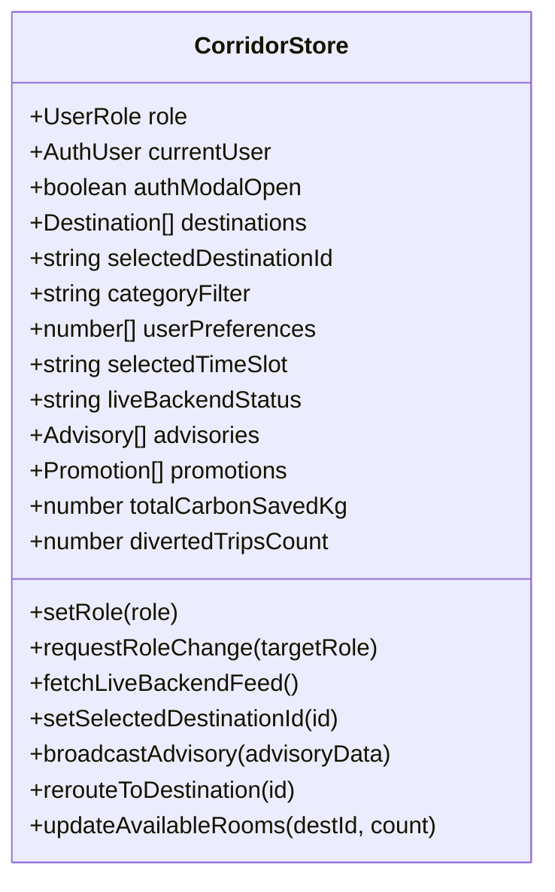
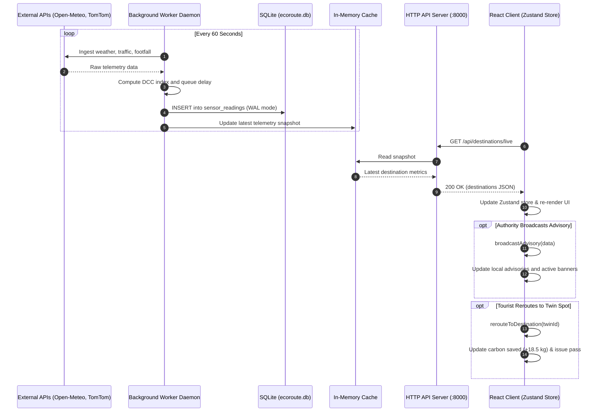

# System Architecture & Technical Design

This document details the internal technical architecture, component structure, data flow pipelines, and mathematical models powering **EcoRoute Bharat**.

---

## 1. High-Level System Architecture

EcoRoute Bharat is engineered as a decoupled, multi-tier system composed of a client-side reactive web portal, a lightweight Python API and data ingestion engine, a persistent SQLite time-series store, and multiple external sensor pipelines.

```mermaid
graph TD
    subgraph External Sensors & Government Data
        OM[Open-Meteo API<br/>Rainfall, Wind, Temp]
        TT[TomTom Traffic Flow API<br/>Speed & Congestion Delays]
        BT[BestTime.app API<br/>Attraction Footfall]
        OSM[OpenStreetMap Overpass<br/>Parking & Viewpoint Nodes]
        OGD[data.gov.in<br/>State Tourism Baselines]
    end

    subgraph Backend Engine & Ingestion (Python 3.13)
        BW[Background Telemetry Worker<br/>60s Daemon Thread]
        ENG_DCC[DCC Calculator Engine<br/>dcc_calculator.py]
        ENG_TWIN[4D Cosine Twin Matcher<br/>twin_matcher.py]
        ENG_ITIN[Itinerary Planning Engine<br/>itinerary_engine.py]
        MEM_CACHE[(In-Memory Telemetry Cache)]
        HTTP_SRV[HTTP REST API Server<br/>main.py :8000]
    end

    subgraph Persistence Tier
        SQLITE[(SQLite 3 Database<br/>ecoroute.db - WAL Mode)]
    end

    subgraph Frontend Presentation Tier (React 19 + TypeScript)
        ZUSTAND[Zustand Central Store<br/>useCorridorStore.ts]
        AUTH_GUARD[RBAC Route Guard<br/>requestRoleChange]
        PORTAL_CITIZEN[Citizen / Tourist Portal<br/>TouristView.tsx]
        PORTAL_AUTH[District GIS Command<br/>AuthorityView.tsx]
        PORTAL_PROV[MTDC Operator Console<br/>ProviderView.tsx]
        BOT[24x7 AI Tourism Helpline<br/>AiHelplineBot.tsx]
    end

    %% Ingestion Flow
    OM -->|HTTP GET| BW
    TT -->|HTTP GET / Fallback| BW
    BT -->|HTTP GET / Fallback| BW
    OSM -->|Overpass Query| BW
    OGD -->|Resource API| BW

    BW --> ENG_DCC
    ENG_DCC --> MEM_CACHE
    BW -->|Write sensor_readings| SQLITE

    %% API Server
    MEM_CACHE --> HTTP_SRV
    ENG_TWIN --> HTTP_SRV
    ENG_ITIN --> HTTP_SRV
    SQLITE <-->|Read / Write| HTTP_SRV

    %% Client Communication
    HTTP_SRV -->|GET /api/destinations/live| ZUSTAND
    ZUSTAND --> AUTH_GUARD
    AUTH_GUARD --> PORTAL_CITIZEN
    AUTH_GUARD --> PORTAL_AUTH
    AUTH_GUARD --> PORTAL_PROV
    ZUSTAND --> BOT
```

---

## 2. Backend Architecture

### 2.1 Native HTTP Server (`backend/main.py`)
The backend is built using Python's standard library `http.server.BaseHTTPRequestHandler` (with zero mandatory external pip dependencies required to launch the core server). It handles:
- Cross-Origin Resource Sharing (CORS) headers for all origins (`*`).
- Route parsing and dispatch for both `GET` and `POST` methods.
- Stakeholder authentication and session token issuance.
- Native serving of Swagger UI documentation at `/docs` backed by `/openapi.json`.

### 2.2 Background Telemetry Worker (`backend/app/background_worker.py`)
A continuous daemon thread (`_worker_thread`) is spawned on server startup:
- **Frequency**: Executes every 60 seconds.
- **Cycle**: Iterates through all 7 destination configurations in `INITIAL_DESTINATIONS`.
- **Pipeline Fetch**: Gathers weather, traffic delays, venue footfall factors, and OSM amenity nodes.
- **Compute**: Calculates the destination's current inflow and Dynamic Carrying Capacity (DCC) index.
- **Persistence**: Writes a snapshot row into the `sensor_readings` SQLite table.
- **Memory Cache**: Updates the global `_telemetry_cache` dictionary to enable instant, sub-millisecond API responses without database query overhead.

### 2.3 Sensor Ingestion Pipelines (`backend/app/pipelines/`)
Each pipeline is designed to be **fail-soft**, ensuring the platform remains fully operational even if external APIs time out or rate-limit requests:

1. **Weather Pipeline (`weather_pipeline.py`)**:
   - Queries `api.open-meteo.com` with destination latitude and longitude.
   - Computes an environmental hazard score:
     $$\text{Hazard Score} = \min\left(1.0, \, \frac{\text{Rain mm}}{15.0} \times 0.70 + \frac{\text{Wind km/h}}{50.0} \times 0.30\right)$$
   - Returns pleasant baseline metrics if the call times out.

2. **Traffic Pipeline (`traffic_pipeline.py`)**:
   - Queries the TomTom Traffic Flow API for highway speed reductions.
   - If no API key is supplied, applies a **diurnal weekend model**: 2.1x multiplier during peak weekend hours (05:00 PM – 09:00 PM and 09:00 AM – 12:00 PM), 1.4x during regular weekend hours, and 1.05x on weekdays.

3. **Footfall Pipeline (`footfall_pipeline.py`)**:
   - Queries BestTime.app for live attraction busyness.
   - Falls back to an hourly busyness model scaling between 0.85x and 1.45x depending on day of week and time of day.
   - Queries OpenStreetMap Overpass API for registered parking lots and viewpoints within a 3km radius.

4. **OGD India Pipeline (`ogd_india.py`)**:
   - Queries `data.gov.in` for Maharashtra and coastal tourism statistics.
   - Calibrates annual domestic tourism visit (DTV) growth rates (+14.8%) and seasonal monsoon indices (1.42x).

---

## 3. Frontend Architecture

### 3.1 Framework & Tooling
- **React 19 & TypeScript 5.8**: Component architecture utilizing strict type safety across all metrics, destinations, and stakeholder records.
- **Vite 7**: Fast developer server and optimized production bundler.
- **Tailwind CSS**: Responsive utility styling paired with government color schemes (`#0f2b48` Navy, `#138808` Green, `#FF9933` Saffron, `#f6c042` Gold).
- **Leaflet & React-Leaflet**: Interactive GIS mapping rendering vector polygons and custom HTML markers.
- **Recharts**: Responsive SVG charts rendering 12-hour diurnal demand curves.
- **Framer Motion**: Smooth entry animations for status meters, modal dialogs, and cards.
- **canvas-confetti**: Celebration animations upon accepting an eco-twin reroute.

### 3.2 State Management (`frontend/src/store/useCorridorStore.ts`)
The entire client application state is managed by a single Zustand store:



### 3.3 State Slices & Persistence
- **Active Role & Authentication**: Tracks whether the user is browsing as `tourist`, `authority`, or `provider`. User profile and session token are persisted in browser `localStorage['ecoroute_auth_user']`.
- **Telemetry Auto-Sync**: The `fetchLiveBackendFeed()` method sends a `GET /api/destinations/live` request on initial mount and every 25 seconds thereafter. If the backend is unreachable, the store gracefully sets `liveBackendStatus: 'offline'` and continues operating using cached destination metrics.
- **Preference Vector**: Tracks a 4D array `[scenic, budget, adventure, family]` adjusted via tag toggle pills.

---

## 4. End-to-End Data Flow



---

## 5. Mathematical Engine Specifications

### 5.1 Dynamic Carrying Capacity (DCC)
Implemented in both `backend/app/engine/dcc_calculator.py` and `frontend/src/lib/engine.ts`:
- **Physical Capacity Utilization**:
  $$U_{\text{cap}} = \frac{I_{\text{curr}}}{C_{\text{base}}}$$
- **Weather Hazard Factor**:
  $$H_{\text{weather}} \in [0.0, 1.0]$$
- **Combined Index**:
  $$\text{DCC} = \text{round}\left(0.70 \times U_{\text{cap}} + 0.30 \times H_{\text{weather}}, \, 2\right)$$
- **Classification**:
  - `OPTIMAL` if $\text{DCC} < 0.70$
  - `MODERATE` if $0.70 \le \text{DCC} < 0.85$
  - `CRITICAL` if $\text{DCC} \ge 0.85$

### 5.2 Queuing Delay Model
When current inflow exceeds physical capacity, bottleneck queue delays are estimated in minutes:
$$\text{Wait Minutes} = \text{round}\left(\frac{I_{\text{curr}} - C_{\text{base}}}{C_{\text{base}}} \times T_{\text{dwell}} \times 60\right)$$
*(where $T_{\text{dwell}}$ is average dwell time in hours, defaulting between 3.0 and 5.0 hours).*

### 5.3 4D Cosine Similarity & Multi-Objective Twin Ranking
Implemented in `twin_matcher.py` and `frontend/src/lib/engine.ts`:
- **Feature Vectors**: Normalized 4D array $\mathbf{v} = [v_{\text{scenic}}, v_{\text{budget}}, v_{\text{adventure}}, v_{\text{family}}]$.
- **Blended Target**:
  $$\mathbf{u}_{\text{blended}} = (0.60 \times \mathbf{v}_{\text{target}}) + (0.40 \times \mathbf{v}_{\text{user\_prefs}})$$
- **Cosine Angle**:
  $$\text{Sim}(\mathbf{u}, \mathbf{v}) = \frac{\mathbf{u} \cdot \mathbf{v}}{\|\mathbf{u}\|_2 \|\mathbf{v}\|_2}$$
- **Multi-Objective Utility Score**:
  $$\text{Utility} = (0.60 \times \text{Sim}) + \left(0.40 \times \max(0, 1.0 - \text{DCC}_{\text{candidate}})\right)$$
Candidate destinations are filtered to ensure $\text{DCC} < 0.70$ and ranked descending by Utility Score.

### 5.4 Diurnal Inflow Gaussian Model
Forecasts 13 discrete hourly intervals between 06:00 AM and 06:00 PM using time-of-day multipliers:
- 06:00 AM: $0.35\times$
- 09:00 AM: $0.82\times$
- 11:00 AM: $1.25\times$
- 12:00 PM: $1.35\times$ *(Peak)*
- 02:00 PM: $1.20\times$
- 05:00 PM: $0.75\times$
- 06:00 PM: $0.50\times$

---

## 6. Persistence Architecture (SQLite 3 WAL Mode)

Database file: `backend/data/ecoroute.db`.
- **Write-Ahead Logging (WAL)**: Initialized via `PRAGMA journal_mode = WAL;` and `PRAGMA synchronous = NORMAL;`.
- **High Concurrency**: Enables concurrent reader processes while the background telemetry daemon executes periodic batch writes.
- **Timeout Configuration**: Connections are established with `timeout=30.0` seconds to avoid SQLite table lock contentions.

---

## 7. Discrepancies & Client-Server Integration Notes

During the codebase inspection, the following architectural realities were observed:
1. **API Coverage vs. Frontend Consumption**:
   - The backend exposes 12 endpoints (`/api/destinations/live`, `/api/destinations/{id}/forecast`, `/api/recommendations/twin`, `/api/itinerary/plan`, `/api/ai/chat`, `/api/auth/login`, `/api/advisories`, `/api/advisories/broadcast`, `/api/passes`, `/api/passes/issue`, `/docs`, `/api/health`).
   - The frontend currently actively consumes `GET /api/destinations/live` (in `useCorridorStore.ts`) and `POST /api/auth/login` (in `AuthModal.tsx`).
   - Other capabilities (e.g., advisory broadcasting in `DigitalAdvisoryDispatcher.tsx`, pass generation in `EcoPassCard.tsx`, and chat responses in `AiHelplineBot.tsx`) currently update client-side Zustand state directly rather than making network requests to their respective backend endpoints.
2. **TouristView Presentation Mode**:
   - `TouristView.tsx` currently renders a fixed comparative showcase (Lonavala vs. Matheran) that was developed for presentation demos. Modular dynamic components exist in `src/components/tourist/` and are fully operational once reconnected.
