# Data Model & Schema Specification

This document details the database schemas, persistent tables, entity relationships, and core TypeScript data structures implemented in **EcoRoute Bharat**.

---

## 1. Database Entity-Relationship Diagram

The persistent database is powered by **SQLite 3** (`backend/data/ecoroute.db`) operating in **Write-Ahead Logging (WAL)** mode.

```mermaid
erDiagram
    DESTINATIONS ||--o{ SENSOR_READINGS : "generates telemetry"
    DESTINATIONS ||--o{ GREEN_YATRA_PASSES : "issues for"
    DESTINATIONS ||--o{ GAZETTE_ADVISORIES : "targeted by"
    DESTINATIONS ||--o{ PROMOTIONS : "hosts"
    DESTINATIONS ||--o{ CHECK_INS : "receives"

    DESTINATIONS {
        text id PK "Unique 3-letter code (e.g. LON, MAT)"
        text name "Destination display title"
        text category "Hill Station | Coastal | Heritage | Pilgrimage"
        real lat "Latitude in decimal degrees"
        real lon "Longitude in decimal degrees"
        integer base_capacity "Maximum baseline safe capacity"
        text base_capacity_source_citation "Authoritative statutory source citation"
        integer base_inflow "Baseline uncalibrated visitor inflow"
        real dwell_hrs "Average visitor visit duration"
        text features_json "4D Vector [Scenic, Budget, Adventure, Family]"
        text district "Administrative district (e.g. Pune, Raigad)"
        text state "State (e.g. Maharashtra)"
        text tagline "Short poetic descriptor"
        text description "Full administrative summary"
        text image_url "High-resolution scenic image URL"
    }

    SENSOR_READINGS {
        integer id PK "Auto-increment primary key"
        text destination_id FK "References destinations(id)"
        text timestamp "ISO 8601 logging timestamp"
        real temperature_c "Ambient temperature in Celsius"
        real rain_mm "Current precipitation rate in mm/hr"
        real wind_kmh "Wind speed in km/h"
        real hazard_score "Normalized landslide hazard score (0.0 - 1.0)"
        real traffic_delay_factor "Congestion multiplier (1.0 = normal)"
        real footfall_factor "Attraction crowd scaling factor"
        integer calculated_inflow "Resulting live visitor count"
        real dcc_score "Calculated DCC index (0.00 - 1.00)"
        text status "OPTIMAL | MODERATE | CRITICAL"
        integer wait_minutes "Estimated checkpoint wait delay in minutes"
    }

    GREEN_YATRA_PASSES {
        text id PK "Unique pass code (e.g. ECO-MH-1788457200)"
        text trip_plan_id "Associated Trip Plan ID"
        text original_spot_name "Overcrowded spot bypassed"
        text twin_spot_name "Alternative twin destination chosen"
        real co2_saved_kg "Estimated kilograms of CO2 avoided"
        integer discount_pct "Partner homestay discount percentage"
        text operator_name "Accredited local partner homestay"
        text issued_at "ISO 8601 issuance timestamp"
        text code "Redemption alphanumeric voucher code"
    }

    GAZETTE_ADVISORIES {
        text id PK "Advisory identifier (e.g. ADV-01)"
        text destination_id "Target destination code or ALL"
        text destination_name "Destination name"
        text severity "low | medium | high | critical"
        text title "Headline alert banner"
        text message "Full official warning details"
        text author "Authorizing agency or officer"
        integer active "1 if currently broadcasted, 0 if dismissed"
        text created_at "ISO 8601 creation timestamp"
    }

    PROMOTIONS {
        text id PK "Promotion identifier (e.g. PROMO-01)"
        text destination_id "Destination code"
        text destination_name "Destination name"
        integer discount_pct "Discount percentage (e.g. 25)"
        text title "Campaign headline"
        text badge "Badge label (e.g. 25% OFF)"
        text description "Incentive terms"
        text code "Redemption coupon code (e.g. HOMESTAY25)"
        text valid_until "Expiration date string"
        text business_name "Name of accredited homestay/hotel"
        text business_type "Homestay | Resort | Adventure Trek | Local Dining"
    }

    CHECK_INS {
        text id PK "Check-in UUID"
        text destination_id "Destination visited"
        text user_name "Community traveler display name"
        text timestamp "ISO 8601 check-in time"
        integer rating "Observed congestion rating (1-5)"
        text comment "Optional traveler on-ground note"
        integer verified "Geofence verified status (1 or 0)"
    }
```



---

## 2. SQLite Database Tables (`backend/app/database.py`)

### 2.1 Table: `destinations`
Stores the official registry of all 7 monitored destinations across the Western Ghats corridor.

| Column | Type | Nullable | Primary Key | Description |
|---|---|:---:|:---:|---|
| `id` | `TEXT` | No | Yes | Unique destination code (`LON`, `MAT`, `BHA`, `ALB`, `KAS`, `MAH`, `TAP`) |
| `name` | `TEXT` | No | No | Full destination name (e.g. `Lonavala & Khandala`) |
| `category` | `TEXT` | No | No | Category (`Hill Station`, `Coastal`, `Heritage`, `Pilgrimage`) |
| `lat` | `REAL` | No | No | Latitude coordinate in decimal degrees |
| `lon` | `REAL` | No | No | Longitude coordinate in decimal degrees |
| `base_capacity` | `INTEGER` | No | No | Baseline physical visitor capacity |
| `base_capacity_source_citation` | `TEXT` | Yes | No | Authoritative statutory carrying capacity study citation |
| `base_inflow` | `INTEGER` | No | No | Baseline uncalibrated visitor inflow |
| `dwell_hrs` | `REAL` | No | No | Average dwell time in hours (used in queuing delay model) |
| `features_json` | `TEXT` | No | No | JSON-encoded 4D vector: `[Scenic, Budget, Adventure, Family]` |
| `district` | `TEXT` | No | No | Administrative district (e.g. `Pune`, `Raigad`, `Satara`) |
| `state` | `TEXT` | No | No | State jurisdiction (e.g. `Maharashtra`) |
| `tagline` | `TEXT` | No | No | Short subtitle tagline |
| `description` | `TEXT` | No | No | Contextual overview of geography and congestion risks |
| `image_url` | `TEXT` | No | No | URL to high-resolution photographic asset |

---

## 3. Frontend TypeScript Interfaces (`frontend/src/types/index.ts`)

### 3.1 Destination & Telemetry Models
```typescript
export type DestinationCategory = 'Hill Station' | 'Coastal' | 'Heritage' | 'Pilgrimage';
export type DCCStatus = 'OPTIMAL' | 'MODERATE' | 'CRITICAL';

export interface NearbyAmenity {
  id: string;
  name: string;
  type: 'food' | 'water' | 'fuel' | 'restroom' | 'medical';
  distanceKm: number;
}

export interface NearbyHotel {
  id: string;
  name: string;
  pricePerNight: number;
  rating: number;
  availableRooms: number;
}

export interface NearbyAttraction {
  id: string;
  name: string;
  type: 'viewpoint' | 'fort' | 'waterfall' | 'temple' | 'lake';
  travelTimeMins: number;
}

export interface Destination {
  id: string;
  code: string;
  name: string;
  category: DestinationCategory;
  coordinates: [number, number]; // [lat, lng]
  physicalCapacity: number;
  base_capacity_source_citation?: string;
  currentInflow: number;
  weatherHazardScore: number;    // 0.0 (clear) to 1.0 (severe storm/landslide)
  avgDwellTimeHours: number;
  features: [number, number, number, number]; // [scenic, budget, adventure, family]
  localPressure: LocalPressure;
  hotelOccupancyPct: number;
  activeAdvisory?: string;
  district: string;
  state: string;
  tagline: string;
  description: string;
  imageUrl: string;
  travelTimeFromHub: string;
  distanceKmFromHub: number;
  highlights: string[];
  bestFor: string[];
  isUnderVisited?: boolean;
  associated_business_ids?: string[];
  historicalWeeklyPattern?: {
    [dayOfWeek: string]: number[]; // 24 hours of normalized traffic multiplier
  };
  nearbyAmenities?: NearbyAmenity[];
  nearbyHotels?: NearbyHotel[];
  nearbyAttractions?: NearbyAttraction[];
}
```

### 3.2 Data Tier Provenance & Community Reporting
```typescript
export interface DataTierProvenance {
  tier1_ground_truth: {
    name: string;
    source: string;
    status: 'ACTIVE' | 'DEGRADED' | 'SIMULATED';
    lastUpdated: string;
    details: string;
  };
  tier2_calibrated: {
    name: string;
    source: string;
    status: 'LIVE' | 'ESTIMATED' | 'OFFLINE';
    lastUpdated: string;
    details: string;
  };
  tier3_algorithmic: {
    name: string;
    model: string;
    status: 'CONFIRMED' | 'CALIBRATING';
    details: string;
  };
  tier4_statutory: {
    name: string;
    citation: string;
    officialCapacity: number;
    auditYear: number;
  };
  confidence_score_pct: number;
}

export interface CheckIn {
  id: string;
  destinationId: string;
  userName: string;
  timestamp: string;
  rating: number; // 1 to 5 stars
  comment: string;
  verified: boolean;
}
```

### 3.3 Trip Planning & GreenPass Digital Certificates
```typescript
export interface TripDayPlan {
  day: number;
  morningSlot: { spotName: string; activity: string; crowdExpected: DCCStatus };
  afternoonSlot: { spotName: string; activity: string; crowdExpected: DCCStatus };
  eveningSlot: { spotName: string; activity: string; crowdExpected: DCCStatus };
}

export interface TripPlan {
  id: string;
  userId: string;
  createdAt: string;
  dates: { start: string; end: string };
  destinations: string[];
  group_type: 'solo' | 'couple' | 'family' | 'friends';
  budget_band: '₹' | '₹₹' | '₹₹₹';
  dayPlans: TripDayPlan[];
  totalCo2SavedKg: number;
}

export interface GreenPass {
  id: string;
  trip_plan_id?: string;
  original_spot_name: string;
  twin_spot_name: string;
  co2_saved_kg: number;
  discountPct: number;
  operatorName: string;
  issued_at: string;
  code: string;
}
```

### 3.4 Search Matching & Multi-Tier Resolution
```typescript
export interface SearchMatch {
  type: 'spot' | 'district' | 'state';
  id: string;
  title: string;
  subtitle: string;
  spotId?: string;
  district?: string;
  state?: string;
  category?: string;
}
```
