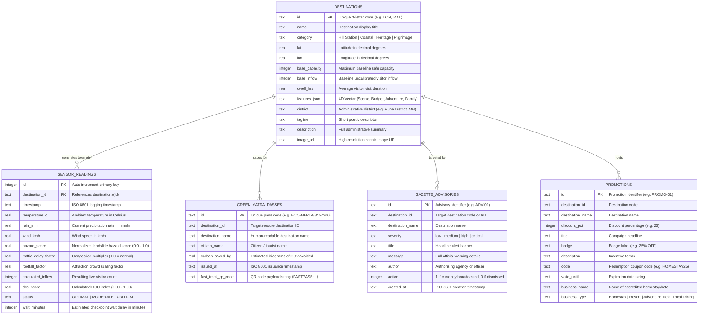

# Data Model & Schema Specification

This document details the database schemas, persistent tables, entity relationships, and core TypeScript data structures implemented in **EcoRoute Bharat**.

---

## 1. Database Entity-Relationship Diagram

The persistent database is powered by **SQLite 3** (`backend/data/ecoroute.db`) operating in **Write-Ahead Logging (WAL)** mode.



---

## 2. SQLite Database Tables (`backend/app/database.py`)

### 2.1 Table: `destinations`
Stores the official registry of all 7 monitored destinations across the Western Ghats corridor.

| Column | Type | Nullable | Primary Key | Description |
|---|---|:---:|:---:|---|
| `id` | `TEXT` | No | Yes | Unique destination code (`LON`, `MAT`, `BHA`, `ALB`, `KAS`, `MAH`, `TAP`) |
| `name` | `TEXT` | No | No | Full destination name (e.g. `Lonavala & Khandala`) |
| `category` | `TEXT` | No | No | Category (`Hill Station`, `Coastal`, `Heritage`, `Pilgrimage`) |
| `lat` | `REAL` | No | No | Latitude coordinate in decimal degrees |
| `lon` | `REAL` | No | No | Longitude coordinate in decimal degrees |
| `base_capacity` | `INTEGER` | No | No | Baseline physical visitor capacity |
| `base_inflow` | `INTEGER` | No | No | Baseline uncalibrated visitor inflow |
| `dwell_hrs` | `REAL` | No | No | Average dwell time in hours (used in queuing delay model) |
| `features_json` | `TEXT` | No | No | JSON-encoded 4D vector: `[Scenic, Budget, Adventure, Family]` |
| `district` | `TEXT` | No | No | Administrative district and state jurisdiction |
| `tagline` | `TEXT` | No | No | Short subtitle tagline |
| `description` | `TEXT` | No | No | Contextual overview of geography and congestion risks |
| `image_url` | `TEXT` | No | No | URL to high-resolution photographic asset |

---

### 2.2 Table: `sensor_readings`
Time-series log table capturing every periodic sync cycle from the background worker.

| Column | Type | Nullable | Primary Key | Description |
|---|---|:---:|:---:|---|
| `id` | `INTEGER` | No | Yes | Auto-increment sequence identifier |
| `destination_id` | `TEXT` | No | No (FK) | Foreign key to `destinations(id)` |
| `timestamp` | `TEXT` | No | No | ISO 8601 UTC timestamp of telemetry recording |
| `temperature_c` | `REAL` | Yes | No | Ambient air temperature in Celsius |
| `rain_mm` | `REAL` | Yes | No | Precipitation rate in mm/hour |
| `wind_kmh` | `REAL` | Yes | No | Wind velocity in km/h |
| `hazard_score` | `REAL` | Yes | No | Calculated landslide/weather hazard (0.0 to 1.0) |
| `traffic_delay_factor` | `REAL` | Yes | No | Speed reduction factor from TomTom Flow API |
| `footfall_factor` | `REAL` | Yes | No | Venue crowding multiplier from BestTime.app API |
| `calculated_inflow` | `INTEGER` | Yes | No | Effective tourist volume combining traffic and footfall |
| `dcc_score` | `REAL` | Yes | No | Calculated Dynamic Carrying Capacity index (0.00 to 1.00) |
| `status` | `TEXT` | Yes | No | Operational status (`OPTIMAL`, `MODERATE`, `CRITICAL`) |
| `wait_minutes` | `INTEGER` | Yes | No | Estimated entry/attraction queue delay in minutes |

---

### 2.3 Table: `green_yatra_passes`
Stores digital travel vouchers issued to rerouted tourists.

| Column | Type | Nullable | Primary Key | Description |
|---|---|:---:|:---:|---|
| `id` | `TEXT` | No | Yes | Generated pass ID (e.g. `ECO-MH-1788457200`) |
| `destination_id` | `TEXT` | No | No | Code of destination redirected to |
| `destination_name` | `TEXT` | No | No | Destination display title |
| `citizen_name` | `TEXT` | No | No | Citizen or tourist name |
| `carbon_saved_kg` | `REAL` | No | No | Estimated carbon footprint savings |
| `issued_at` | `TEXT` | No | No | ISO 8601 issuance timestamp |
| `fast_track_qr_code` | `TEXT` | No | No | Payload string encoded in checkpoint QR codes |

---

### 2.4 Table: `gazette_advisories`
Official administrative warnings, road closure bulletins, and flood alerts.

| Column | Type | Nullable | Primary Key | Description |
|---|---|:---:|:---:|---|
| `id` | `TEXT` | No | Yes | Advisory ID (e.g. `ADV-01`, `ADV-1788457000`) |
| `destination_id` | `TEXT` | No | No | Specific destination code or `ALL` |
| `destination_name` | `TEXT` | No | No | Destination name |
| `severity` | `TEXT` | No | No | Alert severity level (`low`, `medium`, `high`, `critical`) |
| `title` | `TEXT` | No | No | Headline notice |
| `message` | `TEXT` | No | No | Detailed advisory message |
| `author` | `TEXT` | No | No | Authorizing official or agency (e.g. `Pune District Collectorate`) |
| `active` | `INTEGER` | No | No | Flag indicating if advisory is live (`1`) or dismissed (`0`) |
| `created_at` | `TEXT` | No | No | ISO 8601 creation timestamp |

---

### 2.5 Table: `promotions`
Commercial off-peak subsidy vouchers and discounts published by MTDC operators.

| Column | Type | Nullable | Primary Key | Description |
|---|---|:---:|:---:|---|
| `id` | `TEXT` | No | Yes | Promotion identifier |
| `destination_id` | `TEXT` | No | No | Destination code |
| `destination_name` | `TEXT` | No | No | Destination name |
| `discount_pct` | `INTEGER` | No | No | Percentage discount (e.g. `25`) |
| `title` | `TEXT` | No | No | Promotional campaign title |
| `badge` | `TEXT` | No | No | Short badge label |
| `description` | `TEXT` | No | No | Offer description and conditions |
| `code` | `TEXT` | No | No | Promo coupon code (e.g. `HOMESTAY25`) |
| `valid_until` | `TEXT` | No | No | Expiration date |
| `business_name` | `TEXT` | No | No | Name of homestay or resort |
| `business_type` | `TEXT` | No | No | Category (`Homestay`, `Resort`, `Adventure Trek`, `Local Dining`) |

---

## 3. Frontend TypeScript Interfaces (`frontend/src/types/index.ts`)

### 3.1 Destination & Telemetry Types
```typescript
export type DestinationCategory = 'Hill Station' | 'Coastal' | 'Heritage' | 'Pilgrimage';
export type DCCStatus = 'OPTIMAL' | 'MODERATE' | 'CRITICAL';

export interface LocalPressure {
  parkingSaturationPct: number;
  waterStressIndex: number; // 0.0 to 1.0
  municipalWasteAlert: boolean;
}

export interface Destination {
  id: string;
  code: string;
  name: string;
  category: DestinationCategory;
  coordinates: [number, number]; // [lat, lng]
  physicalCapacity: number;
  currentInflow: number;
  weatherHazardScore: number;    // 0.0 (clear) to 1.0 (severe storm/landslide)
  avgDwellTimeHours: number;
  features: [number, number, number, number]; // [scenic, budget, adventure, family]
  localPressure: LocalPressure;
  hotelOccupancyPct: number;
  activeAdvisory?: string;
  district: string;
  tagline: string;
  description: string;
  imageUrl: string;
  travelTimeFromHub: string;
  distanceKmFromHub: number;
  highlights: string[];
  bestFor: string[];
}
```

### 3.2 Evaluation & Recommendation Types
```typescript
export interface DCCMetrics {
  dccScore: number;
  status: DCCStatus;
  capacityUtilization: number;
  waitTimeMinutes: number;
}

export interface TwinRecommendation {
  destination: Destination;
  similarityScore: number;      // 0.0 to 1.0
  candidateDccScore: number;   // DCC score of alternative
  utilityScore: number;        // (0.60 * sim) + (0.40 * (1 - DCC))
  crowdReductionPct: number;   // % fewer tourists compared to target
  travelTimeDeltaText: string; // e.g. "+15 mins from Pune"
  distanceDeltaKm: number;
  activePromo?: Promotion;
}

export interface HourlyForecastPoint {
  hour: string;
  timeLabel: string;
  inflow: number;
  capacity: number;
  dccScore: number;
  weatherRisk: number;
}
```

### 3.3 Stakeholder & Advisory Types
```typescript
export type UserRole = 'tourist' | 'authority' | 'provider';

export interface AuthUser {
  id: string;
  name: string;
  role: UserRole;
  designation: string;
  department: string;
  badgeNumber: string;
  isAuthenticated: boolean;
  token?: string;
}

export interface Advisory {
  id: string;
  destinationId: string;
  destinationName: string;
  severity: 'low' | 'medium' | 'high' | 'critical';
  title: string;
  message: string;
  timestamp: string;
  active: boolean;
  author: string;
}

export interface Promotion {
  id: string;
  destinationId: string;
  destinationName: string;
  discountPct: number;
  title: string;
  badge: string;
  description: string;
  code: string;
  validUntil: string;
  businessName: string;
  businessType: 'Homestay' | 'Resort' | 'Adventure Trek' | 'Local Dining' | 'Eco-Pass';
}
```

---

## 4. Field Constraints & Normalization Rules

1. **Coordinates**: Stored as decimal degrees in WGS84 format (`lat` between -90 and 90, `lon` between -180 and 180).
2. **DCC Score**: Always rounded to 2 decimal places and bounded between `0.00` and `1.00`.
3. **Hazard Score**: Always bounded between `0.00` (safe) and `1.00` (severe hazard).
4. **4D Feature Vectors**: Normalized between `0.00` and `1.00` along all 4 dimensions `[Scenic, Budget, Adventure, Family]`.
5. **Severity Levels**: Restricted to exact plain-text lowercase strings: `'low'`, `'medium'`, `'high'`, or `'critical'`.
