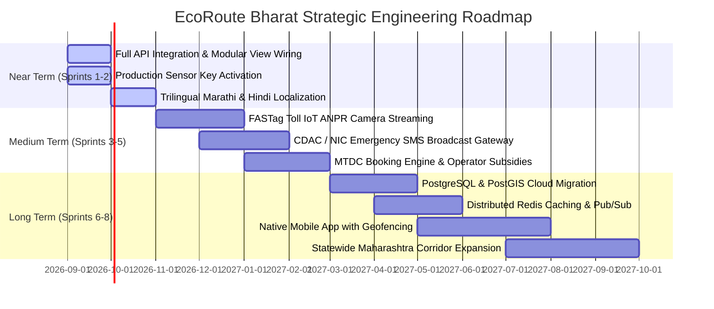

# Strategic Product & Technical Roadmap

This document outlines the strategic future direction, architectural evolution, and major technical milestones for **EcoRoute Bharat**.

While [`TODO.md`](./TODO.md) answers *"What exactly needs to be done on current features?"*, this roadmap answers *"Where is the platform going over the next 6 to 18 months?"*.

---

## Roadmap Timeline Overview

---

## 1. Near-Term Milestones (Sprints 1 – 2)

### Complete Frontend-to-Backend REST Wiring
- **Status**: PARTIAL
- **Why**: The backend already implements endpoints for twin recommendations (`POST /api/recommendations/twin`), future itineraries (`POST /api/itinerary/plan`), pass generation (`POST /api/passes/issue`), advisory broadcasts (`POST /api/advisories/broadcast`), and AI chat (`POST /api/ai/chat`). Currently, several frontend components operate in local client-side state.
- **Goal**: Transition all frontend components to call live backend endpoints with automatic fallback to local state if the network disconnects. Re-integrate modular components (`HeroDCCStatus`, `TwinAlternativeCards`, `DemandCurveChart`, `FutureTripPlanner`, `EcoPassCard`) into `TouristView.tsx`.
- **Dependencies**: React frontend and Python backend HTTP server.
- **Related TODO**: See [TODO.md#8](./TODO.md), [TODO.md#9](./TODO.md), and [TODO.md#12](./TODO.md).

---

### Production External Sensor Key Onboarding
- **Status**: PARTIAL
- **Why**: Currently, TomTom Traffic Flow and BestTime.app rely on fallback models due to placeholder API credentials.
- **Goal**: Onboard enterprise API keys for TomTom Traffic Flow, BestTime.app, and Open Government Data (data.gov.in) to replace simulated diurnal curves with live high-frequency telemetry.
- **Dependencies**: Commercial API credentials.
- **Related TODO**: See [TODO.md#7](./TODO.md).

---

### Full Trilingual Regional Accessibility
- **Status**: PARTIAL
- **Why**: The Western Ghats corridor is visited by regional travelers from Maharashtra, domestic tourists from across India, and international visitors. Public safety and advisory warnings must be instantly understandable in Marathi (मराठी), Hindi (हिन्दी), and English.
- **Goal**: Wire the existing 55-key translation dictionary (`frontend/src/lib/i18n.ts`) into a global language switcher in `Navbar.tsx`, translating all UI headers, charts, status badges, and advisory dispatches dynamically.
- **Dependencies**: `frontend/src/lib/i18n.ts`.
- **Related TODO**: See [TODO.md#17](./TODO.md).

---

## 2. Medium-Term Milestones (Sprints 3 – 5)

### Edge FASTag & ANPR Camera Telemetry Streaming
- **Status**: NOT STARTED
- **Why**: Mountain highways entering Khandala, Khopoli, and Matheran foothills feature automated toll collection plazas. Physical vehicle passage counts offer the most accurate real-time metric of tourist inflow.
- **Goal**: Deploy lightweight MQTT broker listeners to ingest real-time vehicular counts from highway FASTag toll gantries and edge Automatic Number Plate Recognition (ANPR) cameras.
- **Dependencies**: NHAI / MSRDC toll data integration agreement.
- **Related TODO**: See [TODO.md#19](./TODO.md).

---

### CDAC / NIC Government SMS & WhatsApp Broadcast Gateway
- **Status**: NOT STARTED
- **Why**: In mountainous ghat roads, mobile internet data can be intermittent. When a landslide or severe flash flood occurs, emergency advisories must reach travelers immediately via standard SMS or WhatsApp alerts.
- **Goal**: Integrate the platform with the official Government of India CDAC / NIC SMS Gateway. When an authority issues a `critical` advisory, automated SMS alerts are pushed to mobile numbers registered under recent Green Yatra passes within the affected geofence.
- **Dependencies**: NIC / CDAC gateway credentials.
- **Related TODO**: See [TODO.md#21](./TODO.md).

---

### Live MTDC Homestay Booking & Instant Voucher Redemption
- **Status**: NOT STARTED
- **Why**: While operators can publish promo codes in the console, tourists currently redeem them manually upon arrival.
- **Goal**: Integrate MTDC reservation systems to allow tourists to claim discount vouchers and complete verified homestay bookings directly from the recommendation card.
- **Dependencies**: MTDC hospitality booking API.
- **Related TODO**: See [TODO.md#15](./TODO.md).

---

## 3. Long-Term Milestones (Sprints 6 – 8)

### Cloud PostgreSQL & PostGIS Spatial Migration
- **Status**: NOT STARTED
- **Why**: SQLite in WAL mode is excellent for single-server prototyping and local edge deployments, but statewide multi-node cloud deployments require concurrent multi-region writes and spatial geo-queries.
- **Goal**: Migrate schema to managed PostgreSQL with PostGIS extensions. Use spatial indexing (`ST_DWithin`, `ST_Distance`) to compute proximity and optimal bypass routes dynamically.
- **Dependencies**: Cloud database provisioning.
- **Related TODO**: See [TODO.md#22](./TODO.md).

---

### Distributed Redis Caching & Pub/Sub
- **Status**: NOT STARTED
- **Why**: As visitor volume scales into hundreds of thousands of concurrent users during peak holiday long weekends, API requests should not hit the persistence tier.
- **Goal**: Introduce a Redis cluster for 60-second telemetry caching, rate limiting, and real-time WebSocket advisory distribution.
- **Dependencies**: Redis cluster deployment.
- **Related TODO**: See [TODO.md#20](./TODO.md).

---

### Native Mobile Citizen & Officer Application
- **Status**: NOT STARTED
- **Why**: Native mobile apps enable passive background geofencing, push notifications when approaching saturated toll checkpoints, and offline map access when mountain signal is lost.
- **Goal**: Build and publish cross-platform mobile apps for iOS and Android featuring offline Green Pass storage, turn-by-turn bypass navigation, and officer checkpoint QR scanners.
- **Dependencies**: Mobile development framework (React Native or Flutter).

---

### Statewide Corridor Expansion
- **Status**: NOT STARTED
- **Why**: The current deployment monitors 7 key destinations in Pune, Raigad, Satara, and Ahmednagar districts.
- **Goal**: Expand destination registry to 50+ tourism hotspots across Maharashtra, covering the Konkan coastline, Ajanta & Ellora heritage zones, Tadoba wildlife sanctuaries, and Northern Sahyadri hill corridors.
- **Dependencies**: District administration partnerships.
