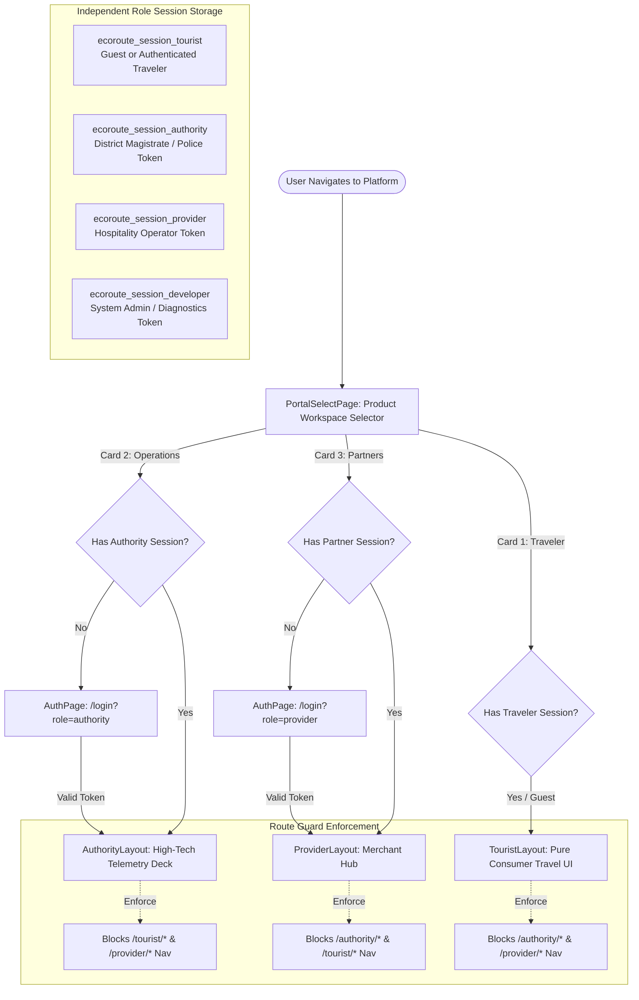
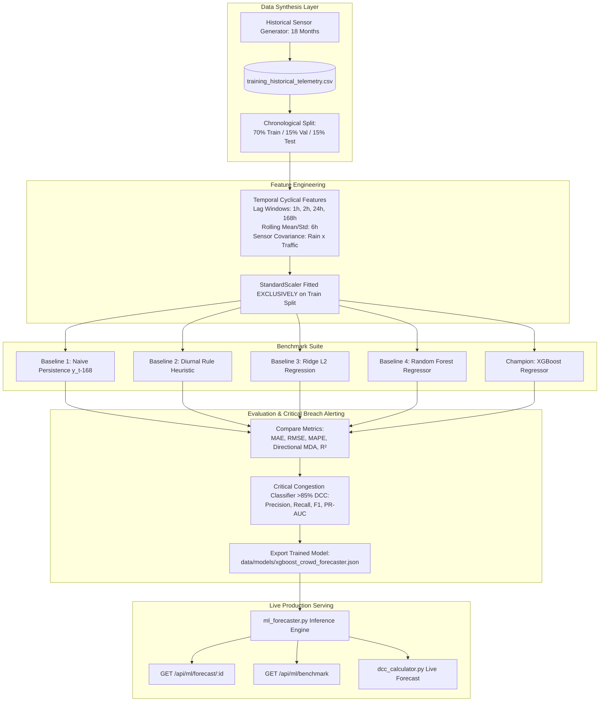
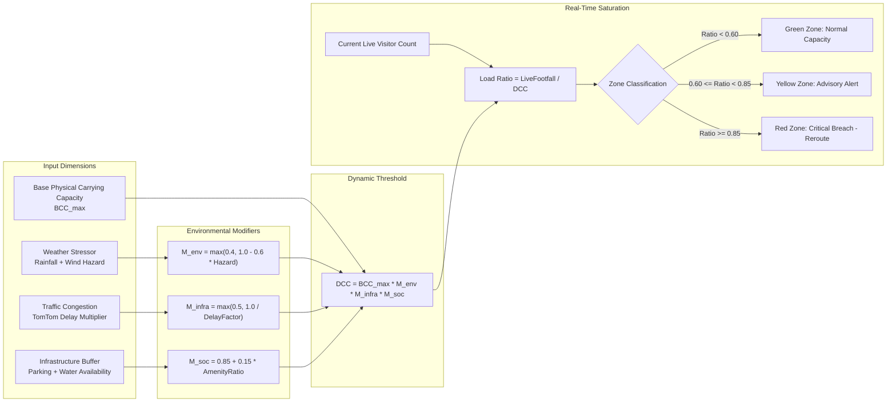
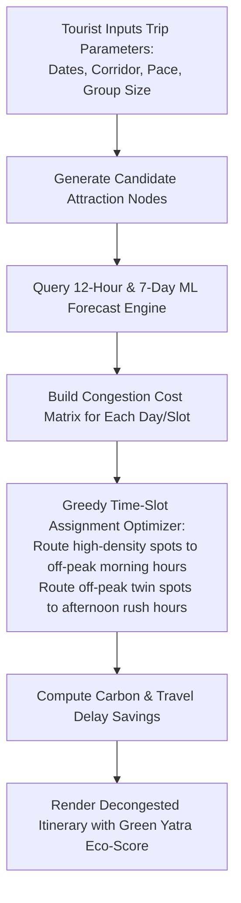

# EcoRoute Bharat - Architecture & Workflow Diagram Reference

This directory serves as the centralized, authoritative repository of all system architecture and workflow diagrams across all implementation phases of EcoRoute Bharat.

---

## Index of Architecture Diagrams

1. [End-to-End System Platform Architecture](#1-end-to-end-system-platform-architecture)
2. [Modern SaaS Multi-Role Authentication & Session Isolation](#2-modern-saas-multi-role-authentication--session-isolation)
3. [Dual-Layer Persistent API Caching Engine](#3-dual-layer-persistent-api-caching-engine)
4. [Machine Learning Forecasting & Benchmark Pipeline](#4-machine-learning-forecasting--benchmark-pipeline)
5. [Dynamic Carrying Capacity (DCC) Calculation Engine](#5-dynamic-carrying-capacity-dcc-calculation-engine)
6. [Twin Destination Matching & Traffic Diversion Workflow](#6-twin-destination-matching--traffic-diversion-workflow)
7. [Predictive Multi-Day Itinerary Decongestion Engine](#7-predictive-multi-day-itinerary-decongestion-engine)

---

## 1. End-to-End System Platform Architecture

Illustrates the complete data journey from live external sensor APIs (TomTom, BestTime, Open-Meteo, OSM, data.gov.in) through the backend analytical pipeline to the isolated stakeholder interfaces.

```mermaid
flowchart TD
    subgraph External Sensors & APIs
        TomTom[TomTom Traffic Flow API<br/>Speed & Congestion Delays]
        BestTime[BestTime.app API<br/>Footfall & Venue Busyness]
        OpenMeteo[Open-Meteo API<br/>Precipitation, Wind, Hazard]
        OSM[OpenStreetMap Overpass<br/>Amenities, Parking, POIs]
        OGD[data.gov.in OGD India<br/>Tourism State Benchmarks]
    end

    subgraph Ingestion & Cache Layer
        CacheMgr[Cache Manager<br/>SQLite api_cache + JSON Disk]
        TomTom & BestTime & OpenMeteo & OSM & OGD --> CacheMgr
        CacheMgr --> Worker[Background Worker Daemon<br/>60s Periodic Sync]
    end

    subgraph Core Analytical Engines
        Worker --> DB[(SQLite ecoroute.db<br/>WAL Mode Concurrency)]
        DB --> DCC[DCC Engine<br/>Dynamic Carrying Capacity]
        DB --> ML[ML Forecaster<br/>XGBoost 12-Hour Predictor]
        DB --> Twin[Twin Matcher<br/>4D Cosine Vector Engine]
        DB --> Itin[Itinerary Planner<br/>Multi-Day Load Balancer]
    end

    subgraph API Gateway & Endpoints
        FastAPI[Python FastAPI / HTTP Server<br/>Port 8000]
        DCC & ML & Twin & Itin --> FastAPI
        FastAPI --> AuthAPI[/api/auth/*]
        FastAPI --> DestAPI[/api/destinations/live]
        FastAPI --> MLAPI[/api/ml/forecast & benchmark]
        FastAPI --> CacheAPI[/api/cache/status]
    end

    subgraph Stakeholder Frontend Portals
        FastAPI --> Tourist[Tourist Portal<br/>Citizen Crowd Meters & Twin Cards]
        FastAPI --> Authority[District GIS Command Center<br/>Heatmaps, Capacity Overrides, Alerts]
        FastAPI --> Provider[Local Business Hub<br/>MTDC Operators, Inventory, Vouchers]
        FastAPI --> Dev[Developer Diagnostics<br/>Pipeline Inspector & Health]
    end
```

---

## 2. Modern SaaS Multi-Role Authentication & Session Isolation

Depicts the entry gateway, dedicated authentication modal, and independent session management ensuring strict stakeholder separation.



---

## 3. Dual-Layer Persistent API Caching Engine

Shows the multi-tier caching mechanism that eliminates redundant external API calls, preserves token quotas, and guarantees sub-2ms response latencies.

```mermaid
flowchart TD
    Req[Incoming Telemetry Query / Background Sweep] --> ResolveKey[Generate Key: source:destination_id or source:lat,lon]
    
    ResolveKey --> CheckMem[1. In-Memory Micro-Cache]
    CheckMem -->|Hit (< 0.1ms)| ReturnActive[Return Cached Telemetry + TTL Remaining]
    
    CheckMem -->|Miss| CheckDB[2. SQLite api_cache Table Query]
    CheckDB -->|Active Entry Found (< 1.5ms)| UpdateMem[Populate Micro-Cache & Return]
    
    CheckDB -->|DB Locked or Miss| CheckFile[3. Disk Backup JSON Inspection]
    CheckFile -->|Valid Backup Found (< 3ms)| ReturnActive
    
    CheckFile -->|Expired or Key Not Found| CallAPI[4. Dispatch External Live API Call]
    
    CallAPI -->|Network Success| DualWrite[Dual-Write Persistence]
    DualWrite --> WriteDB[(Upsert SQLite api_cache)]
    DualWrite --> WriteFile[Write data/cache_backups/*.json]
    
    DualWrite --> ReturnLive[Return Live Telemetry to Pipeline]
    
    CallAPI -->|Network Failure / Quota Exhaustion| Fallback[5. Heuristic Fail-Soft Simulation]
    Fallback --> ReturnLive
```

---

## 4. Machine Learning Forecasting & Benchmark Pipeline

Illustrates data synthesis, feature transformation, chronological train/validation/test splitting, multi-model benchmark comparison, and production serving.



---

## 5. Dynamic Carrying Capacity (DCC) Calculation Engine

Details the mathematical calculation pipeline that dynamically bounds tourism capacity based on real-time environmental and infrastructure stressors.



---

## 6. Twin Destination Matching & Traffic Diversion Workflow

Shows how over-congested source destinations are matched with ecologically resilient "twin" alternates using 4D vector cosine similarity.

```mermaid
flowchart TD
    RedZone[Over-Congested Source Destination<br/>DCC Load Ratio >= 0.85] --> Vectorize[Extract 4D Feature Vector:<br/>Elevation, Terrain Type, Budget Index, Activity Profile]
    
    Vectorize --> Filter[Candidate Filter:<br/>Twin Destination DCC Load Ratio < 0.65<br/>Within Corridor Travel Distance <= 60km]
    
    Filter --> Cosine[Compute 4D Cosine Similarity Score:<br/>cos(theta) = (A . B) / (||A|| * ||B||)]
    
    Cosine --> Rank[Rank Alternates by Cosine Match * (1 - DCC_twin)]
    
    Rank --> TopTwin[Select Top-1 Twin Destination]
    
    TopTwin --> Incentive[Generate Decongestion Incentive Voucher:<br/>MTDC 15% Stay Discount + Priority Eco-Pass]
    
    Incentive --> Push[Push Real-Time Advisory to Tourist Portal & Navigation Map]
```

---

## 7. Predictive Multi-Day Itinerary Decongestion Engine

Shows how multi-day trip itineraries are balanced across space and time to smooth crowd peaks before tourists arrive.


